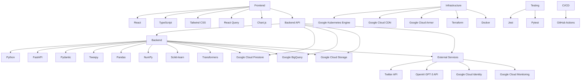

# REPOSITORY STRUCTURE

## OVERVIEW

This repository contains the codebase for the Code Skeptic Scanner, a cloud-based solution that monitors Twitter/X in real-time for skeptical or negative opinions about AI coding tools. The project is structured into frontend, backend, and infrastructure components, with additional directories for scripts, GitHub workflows, and documentation.

## STRUCTURE MAP

```
code-skeptic-scanner/
├── frontend/
│   ├── public/
│   │   └── index.html
│   ├── src/
│   │   ├── components/
│   │   │   ├── Dashboard/
│   │   │   │   ├── RealTimeFeed.tsx
│   │   │   │   ├── KeyMetrics.tsx
│   │   │   │   └── QuickActions.tsx
│   │   │   ├── TweetManagement/
│   │   │   │   ├── TweetList.tsx
│   │   │   │   ├── TweetCard.tsx
│   │   │   │   └── ResponseGenerator.tsx
│   │   │   ├── Analytics/
│   │   │   │   ├── TrendCharts.tsx
│   │   │   │   ├── AIToolComparison.tsx
│   │   │   │   └── UserEngagement.tsx
│   │   │   └── Configuration/
│   │   │       ├── TwitterAPISettings.tsx
│   │   │       ├── LLMSettings.tsx
│   │   │       └── ThresholdConfig.tsx
│   │   ├── pages/
│   │   │   ├── Dashboard.tsx
│   │   │   ├── TweetManagement.tsx
│   │   │   ├── Analytics.tsx
│   │   │   └── Configuration.tsx
│   │   ├── services/
│   │   │   ├── api.ts
│   │   │   ├── twitterService.ts
│   │   │   └── llmService.ts
│   │   ├── store/
│   │   │   ├── index.ts
│   │   │   ├── tweetSlice.ts
│   │   │   └── configSlice.ts
│   │   ├── utils/
│   │   │   ├── dateUtils.ts
│   │   │   └── formatUtils.ts
│   │   ├── schema/
│   │   │   ├── tweetSchema.ts
│   │   │   └── userSchema.ts
│   │   ├── app.tsx
│   │   └── index.tsx
│   ├── package.json
│   └── tsconfig.json
├── backend/
│   ├── app/
│   │   ├── api/
│   │   │   ├── routes/
│   │   │   │   ├── tweets.py
│   │   │   │   ├── users.py
│   │   │   │   ├── analytics.py
│   │   │   │   └── config.py
│   │   │   └── dependencies.py
│   │   ├── core/
│   │   │   ├── config.py
│   │   │   └── security.py
│   │   ├── db/
│   │   │   ├── firestore.py
│   │   │   └── bigquery.py
│   │   ├── services/
│   │   │   ├── twitter_service.py
│   │   │   ├── llm_service.py
│   │   │   └── analytics_service.py
│   │   ├── tasks/
│   │   │   ├── tweet_processor.py
│   │   │   └── response_generator.py
│   │   ├── schema/
│   │   │   ├── tweet.py
│   │   │   └── user.py
│   │   └── main.py
│   ├── tests/
│   │   ├── test_api.py
│   │   ├── test_services.py
│   │   └── test_tasks.py
│   ├── requirements.txt
│   └── Dockerfile
├── infrastructure/
│   ├── terraform/
│   │   ├── main.tf
│   │   ├── variables.tf
│   │   └── outputs.tf
│   └── docker/
│       ├── docker-compose.yml
│       └── nginx.conf
├── scripts/
│   ├── setup_environment.sh
│   └── deploy.sh
├── .github/
│   └── workflows/
│       ├── ci.yml
│       └── cd.yml
├── .gitignore
└── README.md
```

This structure map organizes the Code Skeptic Scanner project into logical modules and sub-modules, represented by folders and files. It covers all the components necessary to implement the technical specification, including frontend, backend, infrastructure, scripts, and GitHub workflows.

The frontend directory contains the React application with TypeScript, organized into components, pages, services, store (for state management), utils, and schema. The backend directory houses the FastAPI application with Python, structured into API routes, core functionality, database interactions, services, tasks, and schemas. The infrastructure directory includes Terraform configurations for cloud resources and Docker files for containerization. Scripts for setup and deployment are included, as well as GitHub workflow configurations for CI/CD processes.

# BACKEND

## SCHEMA

```json
{
    "backend/app/schema": {
        "tweet.py": {
            "description": "Defines the Pydantic model for Tweet data",
            "imports": [
                {"pydantic": "BaseModel"},
                {"typing": "List, Optional"},
                {"datetime": "datetime"}
            ],
            "classes": [
                {
                    "Tweet": {
                        "description": "Pydantic model representing a tweet",
                        "decorators": [],
                        "parameters": [],
                        "properties": [
                            {"str": "tweet_id"},
                            {"str": "content"},
                            {"str": "user_id"},
                            {"datetime": "timestamp"},
                            {"int": "likes_count"},
                            {"int": "retweets_count"},
                            {"float": "doubt_rating"},
                            {"List[str]": "ai_tools"},
                            {"List[str]": "media_urls"},
                            {"Optional[str]": "quoted_tweet_id"}
                        ],
                        "dependencies": {
                            "external": [
                                {
                                    "name": "BaseModel",
                                    "module": "pydantic"
                                }
                            ]
                        },
                        "constructor": {
                            "description": "Initializes a Tweet instance",
                            "parameters": [
                                {"str": "tweet_id"},
                                {"str": "content"},
                                {"str": "user_id"},
                                {"datetime": "timestamp"},
                                {"int": "likes_count"},
                                {"int": "retweets_count"},
                                {"float": "doubt_rating"},
                                {"List[str]": "ai_tools"},
                                {"List[str]": "media_urls"},
                                {"Optional[str]": "quoted_tweet_id"}
                            ],
                            "dependencies": {},
                            "steps": [
                                "Initialize all Tweet attributes with provided values"
                            ]
                        },
                        "functions": [],
                        "confidence": 0.9
                    }
                }
            ]
        },
        "user.py": {
            "description": "Defines the Pydantic model for User data",
            "imports": [
                {"pydantic": "BaseModel"},
                {"datetime": "datetime"}
            ],
            "classes": [
                {
                    "User": {
                        "description": "Pydantic model representing a user",
                        "decorators": [],
                        "parameters": [],
                        "properties": [
                            {"str": "user_id"},
                            {"str": "username"},
                            {"str": "display_name"},
                            {"int": "followers_count"},
                            {"datetime": "created_at"}
                        ],
                        "dependencies": {
                            "external": [
                                {
                                    "name": "BaseModel",
                                    "module": "pydantic"
                                }
                            ]
                        },
                        "constructor": {
                            "description": "Initializes a User instance",
                            "parameters": [
                                {"str": "user_id"},
                                {"str": "username"},
                                {"str": "display_name"},
                                {"int": "followers_count"},
                                {"datetime": "created_at"}
                            ],
                            "dependencies": {},
                            "steps": [
                                "Initialize all User attributes with provided values"
                            ]
                        },
                        "functions": [],
                        "confidence": 0.9
                    }
                }
            ]
        }
    }
}
```

## BACKEND API

```json
{
    "backend/app/api": {
        "routes": {
            "tweets.py": {
                "description": "Handles API routes for tweet-related operations",
                "imports": [
                    {"fastapi": "APIRouter, Depends, HTTPException"},
                    {"typing": "List"},
                    {"sqlalchemy.orm": "Session"},
                    {"app.db.firestore": "get_db"},
                    {"app.schema.tweet": "Tweet"},
                    {"app.services.twitter_service": "TwitterService"},
                    {"app.services.llm_service": "LLMService"}
                ],
                "globals": [
                    {"router": "APIRouter()"}
                ],
                "functions": [
                    {
                        "get_tweets": {
                            "description": "Retrieves a list of tweets",
                            "parameters": [
                                {"Session": "db"},
                                {"int": "skip"},
                                {"int": "limit"}
                            ],
                            "returns": {
                                "List[Tweet]": "List of Tweet objects"
                            },
                            "decorators": ["router.get('/tweets')"],
                            "dependencies": {
                                "internal": [
                                    {
                                        "name": "Tweet",
                                        "module": "app/schema/tweet.py"
                                    },
                                    {
                                        "name": "get_db",
                                        "module": "app/db/firestore.py"
                                    }
                                ],
                                "external": [
                                    {
                                        "name": "Depends",
                                        "module": "fastapi"
                                    }
                                ]
                            },
                            "steps": [
                                "Retrieve tweets from the database",
                                "Apply pagination using skip and limit",
                                "Return list of Tweet objects"
                            ],
                            "confidence": 0.8
                        }
                    },
                    {
                        "get_tweet": {
                            "description": "Retrieves a single tweet by ID",
                            "parameters": [
                                {"Session": "db"},
                                {"str": "tweet_id"}
                            ],
                            "returns": {
                                "Tweet": "Tweet object"
                            },
                            "decorators": ["router.get('/tweets/{tweet_id}')"],
                            "dependencies": {
                                "internal": [
                                    {
                                        "name": "Tweet",
                                        "module": "app/schema/tweet.py"
                                    },
                                    {
                                        "name": "get_db",
                                        "module": "app/db/firestore.py"
                                    }
                                ],
                                "external": [
                                    {
                                        "name": "Depends",
                                        "module": "fastapi"
                                    },
                                    {
                                        "name": "HTTPException",
                                        "module": "fastapi"
                                    }
                                ]
                            },
                            "steps": [
                                "Retrieve tweet from the database by ID",
                                "Raise HTTPException if tweet not found",
                                "Return Tweet object"
                            ],
                            "confidence": 0.9
                        }
                    },
                    {
                        "generate_response": {
                            "description": "Generates a response for a given tweet",
                            "parameters": [
                                {"Session": "db"},
                                {"str": "tweet_id"}
                            ],
                            "returns": {
                                "dict": "Generated response"
                            },
                            "decorators": ["router.post('/tweets/{tweet_id}/responses')"],
                            "dependencies": {
                                "internal": [
                                    {
                                        "name": "Tweet",
                                        "module": "app/schema/tweet.py"
                                    },
                                    {
                                        "name": "get_db",
                                        "module": "app/db/firestore.py"
                                    },
                                    {
                                        "name": "LLMService",
                                        "module": "app/services/llm_service.py"
                                    }
                                ],
                                "external": [
                                    {
                                        "name": "Depends",
                                        "module": "fastapi"
                                    },
                                    {
                                        "name": "HTTPException",
                                        "module": "fastapi"
                                    }
                                ]
                            },
                            "steps": [
                                "Retrieve tweet from the database by ID",
                                "Raise HTTPException if tweet not found",
                                "Use LLMService to generate response",
                                "Store generated response in the database",
                                "Return generated response"
                            ],
                            "confidence": 0.7
                        }
                    }
                ]
            },
            "users.py": {
                "description": "Handles API routes for user-related operations",
                "imports": [
                    {"fastapi": "APIRouter, Depends, HTTPException"},
                    {"typing": "List"},
                    {"sqlalchemy.orm": "Session"},
                    {"app.db.firestore": "get_db"},
                    {"app.schema.user": "User"}
                ],
                "globals": [
                    {"router": "APIRouter()"}
                ],
                "functions": [
                    {
                        "get_users": {
                            "description": "Retrieves a list of users",
                            "parameters": [
                                {"Session": "db"},
                                {"int": "skip"},
                                {"int": "limit"}
                            ],
                            "returns": {
                                "List[User]": "List of User objects"
                            },
                            "decorators": ["router.get('/users')"],
                            "dependencies": {
                                "internal": [
                                    {
                                        "name": "User",
                                        "module": "app/schema/user.py"
                                    },
                                    {
                                        "name": "get_db",
                                        "module": "app/db/firestore.py"
                                    }
                                ],
                                "external": [
                                    {
                                        "name": "Depends",
                                        "module": "fastapi"
                                    }
                                ]
                            },
                            "steps": [
                                "Retrieve users from the database",
                                "Apply pagination using skip and limit",
                                "Return list of User objects"
                            ],
                            "confidence": 0.8
                        }
                    },
                    {
                        "get_user": {
                            "description": "Retrieves a single user by ID",
                            "parameters": [
                                {"Session": "db"},
                                {"str": "user_id"}
                            ],
                            "returns": {
                                "User": "User object"
                            },
                            "decorators": ["router.get('/users/{user_id}')"],
                            "dependencies": {
                                "internal": [
                                    {
                                        "name": "User",
                                        "module": "app/schema/user.py"
                                    },
                                    {
                                        "name": "get_db",
                                        "module": "app/db/firestore.py"
                                    }
                                ],
                                "external": [
                                    {
                                        "name": "Depends",
                                        "module": "fastapi"
                                    },
                                    {
                                        "name": "HTTPException",
                                        "module": "fastapi"
                                    }
                                ]
                            },
                            "steps": [
                                "Retrieve user from the database by ID",
                                "Raise HTTPException if user not found",
                                "Return User object"
                            ],
                            "confidence": 0.9
                        }
                    }
                ]
            },
            "analytics.py": {
                "description": "Handles API routes for analytics-related operations",
                "imports": [
                    {"fastapi": "APIRouter, Depends"},
                    {"typing": "Dict"},
                    {"sqlalchemy.orm": "Session"},
                    {"app.db.firestore": "get_db"},
                    {"app.services.analytics_service": "AnalyticsService"}
                ],
                "globals": [
                    {"router": "APIRouter()"}
                ],
                "functions": [
                    {
                        "get_tweet_analytics": {
                            "description": "Retrieves analytics data for tweets",
                            "parameters": [
                                {"Session": "db"},
                                {"str": "start_date"},
                                {"str": "end_date"}
                            ],
                            "returns": {
                                "Dict": "Analytics data for tweets"
                            },
                            "decorators": ["router.get('/analytics/tweets')"],
                            "dependencies": {
                                "internal": [
                                    {
                                        "name": "get_db",
                                        "module": "app/db/firestore.py"
                                    },
                                    {
                                        "name": "AnalyticsService",
                                        "module": "app/services/analytics_service.py"
                                    }
                                ],
                                "external": [
                                    {
                                        "name": "Depends",
                                        "module": "fastapi"
                                    }
                                ]
                            },
                            "steps": [
                                "Validate date range",
                                "Use AnalyticsService to retrieve tweet analytics",
                                "Return analytics data"
                            ],
                            "confidence": 0.7
                        }
                    },
                    {
                        "get_user_analytics": {
                            "description": "Retrieves analytics data for users",
                            "parameters": [
                                {"Session": "db"},
                                {"str": "start_date"},
                                {"str": "end_date"}
                            ],
                            "returns": {
                                "Dict": "Analytics data for users"
                            },
                            "decorators": ["router.get('/analytics/users')"],
                            "dependencies": {
                                "internal": [
                                    {
                                        "name": "get_db",
                                        "module": "app/db/firestore.py"
                                    },
                                    {
                                        "name": "AnalyticsService",
                                        "module": "app/services/analytics_service.py"
                                    }
                                ],
                                "external": [
                                    {
                                        "name": "Depends",
                                        "module": "fastapi"
                                    }
                                ]
                            },
                            "steps": [
                                "Validate date range",
                                "Use AnalyticsService to retrieve user analytics",
                                "Return analytics data"
                            ],
                            "confidence": 0.7
                        }
                    }
                ]
            },
            "config.py": {
                "description": "Handles API routes for system configuration",
                "imports": [
                    {"fastapi": "APIRouter, Depends, HTTPException"},
                    {"typing": "Dict"},
                    {"sqlalchemy.orm": "Session"},
                    {"app.db.firestore": "get_db"},
                    {"app.core.config": "Settings"}
                ],
                "globals": [
                    {"router": "APIRouter()"}
                ],
                "functions": [
                    {
                        "get_config": {
                            "description": "Retrieves current system configuration",
                            "parameters": [
                                {"Session": "db"}
                            ],
                            "returns": {
                                "Dict": "Current system configuration"
                            },
                            "decorators": ["router.get('/config')"],
                            "dependencies": {
                                "internal": [
                                    {
                                        "name": "get_db",
                                        "module": "app/db/firestore.py"
                                    },
                                    {
                                        "name": "Settings",
                                        "module": "app/core/config.py"
                                    }
                                ],
                                "external": [
                                    {
                                        "name": "Depends",
                                        "module": "fastapi"
                                    }
                                ]
                            },
                            "steps": [
                                "Retrieve current configuration from Settings",
                                "Return configuration as dictionary"
                            ],
                            "confidence": 0.8
                        }
                    },
                    {
                        "update_config": {
                            "description": "Updates system configuration",
                            "parameters": [
                                {"Session": "db"},
                                {"Dict": "config_updates"}
                            ],
                            "returns": {
                                "Dict": "Updated system configuration"
                            },
                            "decorators": ["router.patch('/config')"],
                            "dependencies": {
                                "internal": [
                                    {
                                        "name": "get_db",
                                        "module": "app/db/firestore.py"
                                    },
                                    {
                                        "name": "Settings",
                                        "module": "app/core/config.py"
                                    }
                                ],
                                "external": [
                                    {
                                        "name": "Depends",
                                        "module": "fastapi"
                                    },
                                    {
                                        "name": "HTTPException",
                                        "module": "fastapi"
                                    }
                                ]
                            },
                            "steps": [
                                "Validate configuration updates",
                                "Apply updates to Settings",
                                "Save updated configuration",
                                "Return updated configuration"
                            ],
                            "confidence": 0.6
                        }
                    }
                ]
            }
        },
        "dependencies.py": {
            "description": "Defines common dependencies for API routes",
            "imports": [
                {"fastapi": "Depends, HTTPException"},
                {"fastapi.security": "OAuth2PasswordBearer"},
                {"app.core.security": "verify_token"},
                {"app.db.firestore": "get_db"}
            ],
            "functions": [
                {
                    "get_current_user": {
                        "description": "Dependency to get the current authenticated user",
                        "parameters": [
                            {"str": "token"}
                        ],
                        "returns": {
                            "dict": "User information"
                        },
                        "dependencies": {
                            "internal": [
                                {
                                    "name": "verify_token",
                                    "module": "app/core/security.py"
                                }
                            ],
                            "external": [
                                {
                                    "name": "OAuth2PasswordBearer",
                                    "module": "fastapi.security"
                                },
                                {
                                    "name": "HTTPException",
                                    "module": "fastapi"
                                }
                            ]
                        },
                        "steps": [
                            "Verify the provided token",
                            "Raise HTTPException if token is invalid",
                            "Return user information from verified token"
                        ],
                        "confidence": 0.8
                    }
                }
            ]
        }
    }
}
```

## BACKEND CORE

```json
{
    "backend/app/core": {
        "config.py": {
            "description": "Defines configuration settings for the application",
            "imports": [
                {"pydantic": "BaseSettings"},
                {"typing": "Optional"}
            ],
            "classes": [
                {
                    "Settings": {
                        "description": "Configuration settings for the application",
                        "decorators": [],
                        "parameters": [],
                        "properties": [
                            {"str": "PROJECT_NAME"},
                            {"str": "API_V1_STR"},
                            {"str": "SECRET_KEY"},
                            {"int": "ACCESS_TOKEN_EXPIRE_MINUTES"},
                            {"str": "TWITTER_API_KEY"},
                            {"str": "TWITTER_API_SECRET"},
                            {"str": "TWITTER_ACCESS_TOKEN"},
                            {"str": "TWITTER_ACCESS_TOKEN_SECRET"},
                            {"str": "OPENAI_API_KEY"},
                            {"Optional[str]": "NOTION_API_KEY"},
                            {"str": "GOOGLE_CLOUD_PROJECT"},
                            {"str": "FIRESTORE_COLLECTION_TWEETS"},
                            {"str": "FIRESTORE_COLLECTION_USERS"},
                            {"str": "FIRESTORE_COLLECTION_RESPONSES"},
                            {"str": "BIGQUERY_DATASET"},
                            {"float": "DOUBT_RATING_THRESHOLD"},
                            {"int": "POPULARITY_THRESHOLD"}
                        ],
                        "dependencies": {
                            "external": [
                                {
                                    "name": "BaseSettings",
                                    "module": "pydantic"
                                }
                            ]
                        },
                        "constructor": {
                            "description": "Initializes the Settings class",
                            "parameters": [],
                            "dependencies": {},
                            "steps": [
                                "Initialize all settings with default values or environment variables"
                            ]
                        },
                        "functions": [],
                        "confidence": 0.8
                    }
                }
            ]
        },
        "security.py": {
            "description": "Implements security-related functions and utilities",
            "imports": [
                {"datetime": "datetime, timedelta"},
                {"jose": "jwt"},
                {"passlib.context": "CryptContext"},
                {"app.core.config": "Settings"}
            ],
            "globals": [
                {"pwd_context": "CryptContext(schemes=['bcrypt'], deprecated='auto')"},
                {"settings": "Settings()"}
            ],
            "functions": [
                {
                    "create_access_token": {
                        "description": "Creates a JWT access token",
                        "parameters": [
                            {"dict": "data"},
                            {"Optional[timedelta]": "expires_delta"}
                        ],
                        "returns": {
                            "str": "Encoded JWT token"
                        },
                        "dependencies": {
                            "internal": [
                                {
                                    "name": "Settings",
                                    "module": "app/core/config.py"
                                }
                            ],
                            "external": [
                                {
                                    "name": "jwt",
                                    "module": "jose"
                                },
                                {
                                    "name": "datetime",
                                    "module": "datetime"
                                },
                                {
                                    "name": "timedelta",
                                    "module": "datetime"
                                }
                            ]
                        },
                        "steps": [
                            "Create a copy of the input data",
                            "Set the expiration time for the token",
                            "Add expiration time to the token data",
                            "Encode the token data using JWT",
                            "Return the encoded token"
                        ],
                        "confidence": 0.7
                    },
                    "verify_password": {
                        "description": "Verifies a plain password against a hashed password",
                        "parameters": [
                            {"str": "plain_password"},
                            {"str": "hashed_password"}
                        ],
                        "returns": {
                            "bool": "True if password is valid, False otherwise"
                        },
                        "dependencies": {
                            "external": [
                                {
                                    "name": "CryptContext",
                                    "module": "passlib.context"
                                }
                            ]
                        },
                        "steps": [
                            "Use pwd_context to verify the plain password against the hashed password"
                        ],
                        "confidence": 0.9
                    },
                    "get_password_hash": {
                        "description": "Generates a hash for a given password",
                        "parameters": [
                            {"str": "password"}
                        ],
                        "returns": {
                            "str": "Hashed password"
                        },
                        "dependencies": {
                            "external": [
                                {
                                    "name": "CryptContext",
                                    "module": "passlib.context"
                                }
                            ]
                        },
                        "steps": [
                            "Use pwd_context to hash the input password"
                        ],
                        "confidence": 0.9
                    }
                }
            ]
        }
    }
}
```

## Backend DB

```json
{
    "backend/app/db": {
        "firestore.py": {
            "description": "Handles interactions with Google Cloud Firestore database",
            "imports": [
                {"google.cloud.firestore": "Client"},
                {"google.auth": "default"},
                {"app.core.config": "Settings"}
            ],
            "globals": [
                {"db": "Client()"}
            ],
            "functions": [
                {
                    "get_db": {
                        "description": "Returns a Firestore database client instance",
                        "parameters": [],
                        "returns": {
                            "Client": "Firestore database client"
                        },
                        "decorators": [],
                        "dependencies": {
                            "internal": [
                                {
                                    "name": "Settings",
                                    "module": "app/core/config.py"
                                }
                            ],
                            "external": [
                                {
                                    "name": "Client",
                                    "module": "google.cloud.firestore"
                                },
                                {
                                    "name": "default",
                                    "module": "google.auth"
                                }
                            ]
                        },
                        "steps": [
                            "Initialize Firestore client with project ID from Settings",
                            "Return the initialized client"
                        ],
                        "confidence": 0.8
                    }
                },
                {
                    "add_tweet": {
                        "description": "Adds a new tweet to the Firestore database",
                        "parameters": [
                            {"dict": "tweet_data"}
                        ],
                        "returns": {
                            "str": "Document ID of the added tweet"
                        },
                        "decorators": [],
                        "dependencies": {
                            "internal": [
                                {
                                    "name": "get_db",
                                    "module": "backend/app/db/firestore.py"
                                }
                            ],
                            "external": []
                        },
                        "steps": [
                            "Get Firestore client using get_db()",
                            "Add tweet data to 'tweets' collection",
                            "Return the document ID of the added tweet"
                        ],
                        "confidence": 0.7
                    }
                },
                {
                    "get_tweet": {
                        "description": "Retrieves a tweet from the Firestore database by ID",
                        "parameters": [
                            {"str": "tweet_id"}
                        ],
                        "returns": {
                            "dict": "Tweet data"
                        },
                        "decorators": [],
                        "dependencies": {
                            "internal": [
                                {
                                    "name": "get_db",
                                    "module": "backend/app/db/firestore.py"
                                }
                            ],
                            "external": []
                        },
                        "steps": [
                            "Get Firestore client using get_db()",
                            "Retrieve tweet document from 'tweets' collection by ID",
                            "Return tweet data as dictionary"
                        ],
                        "confidence": 0.8
                    }
                },
                {
                    "update_tweet": {
                        "description": "Updates an existing tweet in the Firestore database",
                        "parameters": [
                            {"str": "tweet_id"},
                            {"dict": "update_data"}
                        ],
                        "returns": {
                            "bool": "True if update was successful, False otherwise"
                        },
                        "decorators": [],
                        "dependencies": {
                            "internal": [
                                {
                                    "name": "get_db",
                                    "module": "backend/app/db/firestore.py"
                                }
                            ],
                            "external": []
                        },
                        "steps": [
                            "Get Firestore client using get_db()",
                            "Update tweet document in 'tweets' collection",
                            "Return True if update was successful, False otherwise"
                        ],
                        "confidence": 0.7
                    }
                }
            ],
            "classes": []
        },
        "bigquery.py": {
            "description": "Handles interactions with Google BigQuery for analytics",
            "imports": [
                {"google.cloud.bigquery": "Client"},
                {"app.core.config": "Settings"}
            ],
            "globals": [
                {"bq_client": "Client()"}
            ],
            "functions": [
                {
                    "get_bq_client": {
                        "description": "Returns a BigQuery client instance",
                        "parameters": [],
                        "returns": {
                            "Client": "BigQuery client"
                        },
                        "decorators": [],
                        "dependencies": {
                            "internal": [
                                {
                                    "name": "Settings",
                                    "module": "app/core/config.py"
                                }
                            ],
                            "external": [
                                {
                                    "name": "Client",
                                    "module": "google.cloud.bigquery"
                                }
                            ]
                        },
                        "steps": [
                            "Initialize BigQuery client with project ID from Settings",
                            "Return the initialized client"
                        ],
                        "confidence": 0.8
                    }
                },
                {
                    "run_query": {
                        "description": "Executes a BigQuery SQL query and returns the results",
                        "parameters": [
                            {"str": "query"}
                        ],
                        "returns": {
                            "list": "Query results as a list of dictionaries"
                        },
                        "decorators": [],
                        "dependencies": {
                            "internal": [
                                {
                                    "name": "get_bq_client",
                                    "module": "backend/app/db/bigquery.py"
                                }
                            ],
                            "external": []
                        },
                        "steps": [
                            "Get BigQuery client using get_bq_client()",
                            "Execute the provided SQL query",
                            "Fetch and return query results as a list of dictionaries"
                        ],
                        "confidence": 0.7
                    }
                },
                {
                    "insert_tweet_analytics": {
                        "description": "Inserts tweet analytics data into BigQuery",
                        "parameters": [
                            {"dict": "analytics_data"}
                        ],
                        "returns": {
                            "bool": "True if insertion was successful, False otherwise"
                        },
                        "decorators": [],
                        "dependencies": {
                            "internal": [
                                {
                                    "name": "get_bq_client",
                                    "module": "backend/app/db/bigquery.py"
                                }
                            ],
                            "external": []
                        },
                        "steps": [
                            "Get BigQuery client using get_bq_client()",
                            "Prepare analytics data for insertion",
                            "Insert data into the tweet_analytics table",
                            "Return True if insertion was successful, False otherwise"
                        ],
                        "confidence": 0.6
                    }
                }
            ],
            "classes": []
        }
    }
}
```

## SERVICES

```json
{
    "backend/app/services": {
        "twitter_service.py": {
            "description": "Handles interactions with the Twitter API for tweet monitoring and data retrieval",
            "imports": [
                {"tweepy": "StreamListener, OAuthHandler, API"},
                {"app.core.config": "Settings"},
                {"app.db.firestore": "add_tweet"},
                {"app.schema.tweet": "Tweet"}
            ],
            "globals": [
                {"settings": "Settings()"}
            ],
            "classes": [
                {
                    "TwitterStreamListener": {
                        "description": "Custom StreamListener for processing incoming tweets",
                        "decorators": [],
                        "parameters": [],
                        "properties": [],
                        "dependencies": {
                            "external": [
                                {
                                    "name": "StreamListener",
                                    "module": "tweepy"
                                }
                            ],
                            "internal": [
                                {
                                    "name": "add_tweet",
                                    "module": "app/db/firestore.py"
                                },
                                {
                                    "name": "Tweet",
                                    "module": "app/schema/tweet.py"
                                }
                            ]
                        },
                        "constructor": {
                            "description": "Initializes the TwitterStreamListener",
                            "parameters": [],
                            "dependencies": {},
                            "steps": [
                                "Call parent constructor",
                                "Initialize any necessary attributes"
                            ]
                        },
                        "functions": [
                            {
                                "on_status": {
                                    "description": "Processes incoming tweet status",
                                    "parameters": [
                                        {"tweepy.Status": "status"}
                                    ],
                                    "returns": {
                                        "bool": "True if processing should continue, False otherwise"
                                    },
                                    "dependencies": {
                                        "internal": [
                                            {
                                                "name": "add_tweet",
                                                "module": "app/db/firestore.py"
                                            },
                                            {
                                                "name": "Tweet",
                                                "module": "app/schema/tweet.py"
                                            }
                                        ]
                                    },
                                    "steps": [
                                        "Extract relevant information from the status",
                                        "Create a Tweet object",
                                        "Add the tweet to the database",
                                        "Return True to continue processing"
                                    ],
                                    "confidence": 0.7
                                }
                            }
                        ],
                        "confidence": 0.8
                    }
                }
            ],
            "functions": [
                {
                    "start_twitter_stream": {
                        "description": "Initializes and starts the Twitter stream",
                        "parameters": [],
                        "returns": {
                            "None": "This function doesn't return anything"
                        },
                        "decorators": [],
                        "dependencies": {
                            "external": [
                                {
                                    "name": "OAuthHandler",
                                    "module": "tweepy"
                                },
                                {
                                    "name": "API",
                                    "module": "tweepy"
                                }
                            ],
                            "internal": [
                                {
                                    "name": "TwitterStreamListener",
                                    "module": "backend/app/services/twitter_service.py"
                                },
                                {
                                    "name": "Settings",
                                    "module": "app/core/config.py"
                                }
                            ]
                        },
                        "steps": [
                            "Set up OAuth authentication",
                            "Create API object",
                            "Initialize TwitterStreamListener",
                            "Start streaming with specified filters"
                        ],
                        "confidence": 0.6
                    }
                }
            ]
        },
        "llm_service.py": {
            "description": "Handles interactions with the LLM API for response generation",
            "imports": [
                {"openai": "Completion"},
                {"app.core.config": "Settings"},
                {"app.schema.tweet": "Tweet"}
            ],
            "globals": [
                {"settings": "Settings()"}
            ],
            "functions": [
                {
                    "generate_response": {
                        "description": "Generates a response for a given tweet using the LLM",
                        "parameters": [
                            {"Tweet": "tweet"}
                        ],
                        "returns": {
                            "str": "Generated response"
                        },
                        "decorators": [],
                        "dependencies": {
                            "external": [
                                {
                                    "name": "Completion",
                                    "module": "openai"
                                }
                            ],
                            "internal": [
                                {
                                    "name": "Settings",
                                    "module": "app/core/config.py"
                                },
                                {
                                    "name": "Tweet",
                                    "module": "app/schema/tweet.py"
                                }
                            ]
                        },
                        "steps": [
                            "Prepare the prompt using tweet content and context",
                            "Call the OpenAI API to generate a response",
                            "Process and format the generated response",
                            "Return the formatted response"
                        ],
                        "confidence": 0.5
                    }
                }
            ],
            "classes": []
        },
        "analytics_service.py": {
            "description": "Provides analytics and data processing functions",
            "imports": [
                {"pandas": "DataFrame"},
                {"app.db.bigquery": "run_query"},
                {"app.core.config": "Settings"}
            ],
            "globals": [
                {"settings": "Settings()"}
            ],
            "functions": [
                {
                    "get_tweet_analytics": {
                        "description": "Retrieves analytics data for tweets",
                        "parameters": [
                            {"str": "start_date"},
                            {"str": "end_date"}
                        ],
                        "returns": {
                            "dict": "Analytics data for tweets"
                        },
                        "decorators": [],
                        "dependencies": {
                            "external": [
                                {
                                    "name": "DataFrame",
                                    "module": "pandas"
                                }
                            ],
                            "internal": [
                                {
                                    "name": "run_query",
                                    "module": "app/db/bigquery.py"
                                },
                                {
                                    "name": "Settings",
                                    "module": "app/core/config.py"
                                }
                            ]
                        },
                        "steps": [
                            "Prepare SQL query for tweet analytics",
                            "Execute query using BigQuery",
                            "Process query results using pandas",
                            "Calculate relevant metrics",
                            "Return processed analytics data"
                        ],
                        "confidence": 0.7
                    }
                },
                {
                    "get_user_analytics": {
                        "description": "Retrieves analytics data for users",
                        "parameters": [
                            {"str": "start_date"},
                            {"str": "end_date"}
                        ],
                        "returns": {
                            "dict": "Analytics data for users"
                        },
                        "decorators": [],
                        "dependencies": {
                            "external": [
                                {
                                    "name": "DataFrame",
                                    "module": "pandas"
                                }
                            ],
                            "internal": [
                                {
                                    "name": "run_query",
                                    "module": "app/db/bigquery.py"
                                },
                                {
                                    "name": "Settings",
                                    "module": "app/core/config.py"
                                }
                            ]
                        },
                        "steps": [
                            "Prepare SQL query for user analytics",
                            "Execute query using BigQuery",
                            "Process query results using pandas",
                            "Calculate relevant metrics",
                            "Return processed analytics data"
                        ],
                        "confidence": 0.7
                    }
                }
            ],
            "classes": []
        }
    }
}
```

This JSON representation provides a detailed structure of the `backend/app/services` folder, including the `twitter_service.py`, `llm_service.py`, and `analytics_service.py` files. Each file contains relevant imports, globals, functions, and classes as applicable. The confidence scores are assigned conservatively, considering the complexity of external API interactions, data processing, and potential customization requirements.

## BACKEND TASKS

```json
{
    "backend/app/tasks": {
        "tweet_processor.py": {
            "description": "Processes incoming tweets from the Twitter Streaming API",
            "imports": [
                {"tweepy": "StreamListener"},
                {"app.db.firestore": "add_tweet"},
                {"app.schema.tweet": "Tweet"},
                {"app.services.llm_service": "LLMService"},
                {"app.core.config": "Settings"}
            ],
            "globals": [
                {"settings": "Settings()"}
            ],
            "classes": [
                {
                    "TweetStreamListener": {
                        "description": "Custom StreamListener for processing incoming tweets",
                        "decorators": [],
                        "parameters": [],
                        "properties": [
                            {"LLMService": "llm_service"}
                        ],
                        "dependencies": {
                            "external": [
                                {
                                    "name": "StreamListener",
                                    "module": "tweepy"
                                }
                            ],
                            "internal": [
                                {
                                    "name": "add_tweet",
                                    "module": "app/db/firestore.py"
                                },
                                {
                                    "name": "Tweet",
                                    "module": "app/schema/tweet.py"
                                },
                                {
                                    "name": "LLMService",
                                    "module": "app/services/llm_service.py"
                                },
                                {
                                    "name": "Settings",
                                    "module": "app/core/config.py"
                                }
                            ]
                        },
                        "constructor": {
                            "description": "Initializes the TweetStreamListener",
                            "parameters": [],
                            "dependencies": {
                                "internal": [
                                    {
                                        "name": "LLMService",
                                        "module": "app/services/llm_service.py"
                                    }
                                ]
                            },
                            "steps": [
                                "Call parent constructor",
                                "Initialize LLMService"
                            ]
                        },
                        "functions": [
                            {
                                "on_status": {
                                    "description": "Processes incoming tweet status",
                                    "parameters": [
                                        {"tweepy.Status": "status"}
                                    ],
                                    "returns": {
                                        "bool": "True if processing should continue, False otherwise"
                                    },
                                    "dependencies": {
                                        "internal": [
                                            {
                                                "name": "add_tweet",
                                                "module": "app/db/firestore.py"
                                            },
                                            {
                                                "name": "Tweet",
                                                "module": "app/schema/tweet.py"
                                            }
                                        ]
                                    },
                                    "steps": [
                                        "Extract relevant information from the status",
                                        "Check if tweet meets popularity threshold",
                                        "Calculate doubt rating using LLMService",
                                        "Create a Tweet object",
                                        "Add the tweet to the database",
                                        "Return True to continue processing"
                                    ],
                                    "confidence": 0.7
                                }
                            }
                        ],
                        "confidence": 0.6
                    }
                }
            ],
            "functions": [
                {
                    "start_tweet_stream": {
                        "description": "Initializes and starts the Twitter stream",
                        "parameters": [],
                        "returns": {
                            "None": "This function doesn't return anything"
                        },
                        "decorators": [],
                        "dependencies": {
                            "external": [
                                {
                                    "name": "tweepy",
                                    "module": "tweepy"
                                }
                            ],
                            "internal": [
                                {
                                    "name": "TweetStreamListener",
                                    "module": "backend/app/tasks/tweet_processor.py"
                                },
                                {
                                    "name": "Settings",
                                    "module": "app/core/config.py"
                                }
                            ]
                        },
                        "steps": [
                            "Set up OAuth authentication using settings",
                            "Create tweepy API object",
                            "Initialize TweetStreamListener",
                            "Start streaming with specified filters"
                        ],
                        "confidence": 0.5
                    }
                }
            ]
        },
        "response_generator.py": {
            "description": "Generates responses for processed tweets",
            "imports": [
                {"app.db.firestore": "get_tweet, add_response"},
                {"app.schema.tweet": "Tweet"},
                {"app.services.llm_service": "LLMService"},
                {"app.core.config": "Settings"}
            ],
            "globals": [
                {"settings": "Settings()"},
                {"llm_service": "LLMService()"}
            ],
            "functions": [
                {
                    "generate_response": {
                        "description": "Generates a response for a given tweet",
                        "parameters": [
                            {"str": "tweet_id"}
                        ],
                        "returns": {
                            "str": "Generated response content"
                        },
                        "decorators": [],
                        "dependencies": {
                            "internal": [
                                {
                                    "name": "get_tweet",
                                    "module": "app/db/firestore.py"
                                },
                                {
                                    "name": "add_response",
                                    "module": "app/db/firestore.py"
                                },
                                {
                                    "name": "Tweet",
                                    "module": "app/schema/tweet.py"
                                },
                                {
                                    "name": "LLMService",
                                    "module": "app/services/llm_service.py"
                                }
                            ]
                        },
                        "steps": [
                            "Retrieve tweet from database",
                            "Generate response using LLMService",
                            "Add response to database",
                            "Return generated response content"
                        ],
                        "confidence": 0.6
                    }
                },
                {
                    "process_pending_responses": {
                        "description": "Processes tweets without responses and generates responses for them",
                        "parameters": [],
                        "returns": {
                            "int": "Number of responses generated"
                        },
                        "decorators": [],
                        "dependencies": {
                            "internal": [
                                {
                                    "name": "get_tweet",
                                    "module": "app/db/firestore.py"
                                },
                                {
                                    "name": "generate_response",
                                    "module": "backend/app/tasks/response_generator.py"
                                }
                            ]
                        },
                        "steps": [
                            "Query database for tweets without responses",
                            "For each tweet, call generate_response",
                            "Return count of responses generated"
                        ],
                        "confidence": 0.7
                    }
                }
            ]
        }
    }
}
```

## MAIN.PY

```json
{
    "backend/app": {
        "main.py": {
            "description": "Main entry point for the Code Skeptic Scanner backend application",
            "imports": [
                {"fastapi": "FastAPI"},
                {"fastapi.middleware.cors": "CORSMiddleware"},
                {"app.api.routes": "tweets, users, analytics, config"},
                {"app.core.config": "Settings"},
                {"app.tasks.tweet_processor": "start_tweet_stream"},
                {"app.db.firestore": "get_db"}
            ],
            "globals": [
                {"app": "FastAPI()"},
                {"settings": "Settings()"}
            ],
            "functions": [
                {
                    "configure_cors": {
                        "description": "Configures CORS settings for the FastAPI application",
                        "parameters": [
                            {"FastAPI": "app"}
                        ],
                        "returns": {
                            "None": "This function doesn't return anything"
                        },
                        "decorators": [],
                        "dependencies": {
                            "internal": [
                                {
                                    "name": "Settings",
                                    "module": "app/core/config.py"
                                }
                            ],
                            "external": [
                                {
                                    "name": "CORSMiddleware",
                                    "module": "fastapi.middleware.cors"
                                }
                            ]
                        },
                        "steps": [
                            "Add CORSMiddleware to the FastAPI app",
                            "Set allowed origins, credentials, methods, and headers"
                        ],
                        "confidence": 0.9
                    }
                },
                {
                    "include_routers": {
                        "description": "Includes all API routers in the FastAPI application",
                        "parameters": [
                            {"FastAPI": "app"}
                        ],
                        "returns": {
                            "None": "This function doesn't return anything"
                        },
                        "decorators": [],
                        "dependencies": {
                            "internal": [
                                {
                                    "name": "tweets",
                                    "module": "app/api/routes/tweets.py"
                                },
                                {
                                    "name": "users",
                                    "module": "app/api/routes/users.py"
                                },
                                {
                                    "name": "analytics",
                                    "module": "app/api/routes/analytics.py"
                                },
                                {
                                    "name": "config",
                                    "module": "app/api/routes/config.py"
                                }
                            ],
                            "external": []
                        },
                        "steps": [
                            "Include tweets router",
                            "Include users router",
                            "Include analytics router",
                            "Include config router"
                        ],
                        "confidence": 0.9
                    }
                },
                {
                    "startup_event": {
                        "description": "Handles application startup events",
                        "parameters": [],
                        "returns": {
                            "None": "This function doesn't return anything"
                        },
                        "decorators": ["app.on_event('startup')"],
                        "dependencies": {
                            "internal": [
                                {
                                    "name": "start_tweet_stream",
                                    "module": "app/tasks/tweet_processor.py"
                                },
                                {
                                    "name": "get_db",
                                    "module": "app/db/firestore.py"
                                }
                            ],
                            "external": []
                        },
                        "steps": [
                            "Initialize database connection",
                            "Start tweet streaming process"
                        ],
                        "confidence": 0.7
                    }
                },
                {
                    "shutdown_event": {
                        "description": "Handles application shutdown events",
                        "parameters": [],
                        "returns": {
                            "None": "This function doesn't return anything"
                        },
                        "decorators": ["app.on_event('shutdown')"],
                        "dependencies": {
                            "internal": [
                                {
                                    "name": "get_db",
                                    "module": "app/db/firestore.py"
                                }
                            ],
                            "external": []
                        },
                        "steps": [
                            "Close database connection",
                            "Perform any necessary cleanup"
                        ],
                        "confidence": 0.8
                    }
                }
            ],
            "classes": []
        }
    }
}
```

## BACKEND TESTS

```json
{
    "backend/tests": {
        "test_api.py": {
            "description": "Contains unit tests for the API endpoints",
            "outline": "- Test cases for tweet-related API endpoints\n- Test cases for user-related API endpoints\n- Test cases for analytics-related API endpoints\n- Test cases for configuration-related API endpoints"
        },
        "test_services.py": {
            "description": "Contains unit tests for the service layer",
            "outline": "- Test cases for TwitterService\n- Test cases for LLMService\n- Test cases for AnalyticsService"
        },
        "test_tasks.py": {
            "description": "Contains unit tests for background tasks",
            "outline": "- Test cases for tweet processing tasks\n- Test cases for response generation tasks"
        }
    }
}
```

# FRONTEND

## SCHEMA

```json
{
    "frontend/src/schema": {
        "tweetSchema.ts": {
            "description": "Defines the TypeScript interface for Tweet data",
            "imports": [
                {"zod": "z"}
            ],
            "globals": [],
            "functions": [],
            "classes": [],
            "interfaces": [
                {
                    "Tweet": {
                        "description": "Interface representing a tweet",
                        "properties": [
                            {"string": "tweet_id"},
                            {"string": "content"},
                            {"string": "user_id"},
                            {"Date": "timestamp"},
                            {"number": "likes_count"},
                            {"number": "retweets_count"},
                            {"number": "doubt_rating"},
                            {"string[]": "ai_tools"},
                            {"string[]": "media_urls"},
                            {"string | null": "quoted_tweet_id"}
                        ],
                        "dependencies": {
                            "external": [
                                {
                                    "name": "z",
                                    "module": "zod"
                                }
                            ]
                        },
                        "confidence": 0.9
                    }
                }
            ],
            "schemas": [
                {
                    "tweetSchema": {
                        "description": "Zod schema for validating Tweet data",
                        "dependencies": {
                            "external": [
                                {
                                    "name": "z",
                                    "module": "zod"
                                }
                            ]
                        },
                        "confidence": 0.8
                    }
                }
            ]
        },
        "userSchema.ts": {
            "description": "Defines the TypeScript interface for User data",
            "imports": [
                {"zod": "z"}
            ],
            "globals": [],
            "functions": [],
            "classes": [],
            "interfaces": [
                {
                    "User": {
                        "description": "Interface representing a user",
                        "properties": [
                            {"string": "user_id"},
                            {"string": "username"},
                            {"string": "display_name"},
                            {"number": "followers_count"},
                            {"Date": "created_at"}
                        ],
                        "dependencies": {
                            "external": [
                                {
                                    "name": "z",
                                    "module": "zod"
                                }
                            ]
                        },
                        "confidence": 0.9
                    }
                }
            ],
            "schemas": [
                {
                    "userSchema": {
                        "description": "Zod schema for validating User data",
                        "dependencies": {
                            "external": [
                                {
                                    "name": "z",
                                    "module": "zod"
                                }
                            ]
                        },
                        "confidence": 0.8
                    }
                }
            ]
        }
    }
}
```

This JSON representation provides a detailed structure of the `frontend/src/schema` folder, including the `tweetSchema.ts` and `userSchema.ts` files. Each file contains relevant imports, interfaces, and Zod schemas for data validation. The confidence scores are assigned conservatively, considering the simplicity of the schemas and their reliance on the external Zod library.

## FRONTEND UTILS

```json
{
    "frontend/src/utils": {
        "dateUtils.ts": {
            "description": "Utility functions for date and time operations",
            "imports": [
                {"dayjs": "dayjs"}
            ],
            "functions": [
                {
                    "formatDate": {
                        "description": "Formats a date string or timestamp into a human-readable format",
                        "parameters": [
                            {"string | number": "date"},
                            {"string": "format"}
                        ],
                        "returns": {
                            "string": "Formatted date string"
                        },
                        "dependencies": {
                            "external": [
                                {
                                    "name": "dayjs",
                                    "module": "dayjs"
                                }
                            ]
                        },
                        "steps": [
                            "Parse the input date using dayjs",
                            "Apply the specified format",
                            "Return the formatted date string"
                        ],
                        "confidence": 0.9
                    }
                },
                {
                    "getTimeAgo": {
                        "description": "Calculates the time difference between a given date and now in a human-readable format",
                        "parameters": [
                            {"string | number": "date"}
                        ],
                        "returns": {
                            "string": "Human-readable time difference"
                        },
                        "dependencies": {
                            "external": [
                                {
                                    "name": "dayjs",
                                    "module": "dayjs"
                                }
                            ]
                        },
                        "steps": [
                            "Parse the input date using dayjs",
                            "Calculate the difference between the input date and now",
                            "Format the difference into a human-readable string",
                            "Return the formatted time difference"
                        ],
                        "confidence": 0.8
                    }
                }
            ]
        },
        "formatUtils.ts": {
            "description": "Utility functions for formatting various data types",
            "functions": [
                {
                    "formatNumber": {
                        "description": "Formats a number with commas as thousands separators",
                        "parameters": [
                            {"number": "num"}
                        ],
                        "returns": {
                            "string": "Formatted number string"
                        },
                        "steps": [
                            "Convert the number to a string",
                            "Use regex to add commas as thousands separators",
                            "Return the formatted number string"
                        ],
                        "confidence": 0.9
                    }
                },
                {
                    "truncateText": {
                        "description": "Truncates a string to a specified length and adds an ellipsis if necessary",
                        "parameters": [
                            {"string": "text"},
                            {"number": "maxLength"}
                        ],
                        "returns": {
                            "string": "Truncated string"
                        },
                        "steps": [
                            "Check if the text length exceeds the maxLength",
                            "If it does, truncate the text and add an ellipsis",
                            "Return the truncated or original text"
                        ],
                        "confidence": 0.9
                    }
                }
            ]
        }
    }
}
```

This JSON representation provides a detailed structure of the `frontend/src/utils` folder, including the `dateUtils.ts` and `formatUtils.ts` files. Each file contains relevant utility functions for date formatting and general data formatting, respectively. The confidence scores are assigned conservatively, considering the simplicity of the functions and their reliance on well-established libraries or straightforward logic.

## FRONTEND SERVICES

```json
{
    "frontend/src/services": {
        "api.ts": {
            "description": "Handles API requests to the backend",
            "imports": [
                {"axios": "axios"},
                {"app/schema/tweet": "Tweet"},
                {"app/schema/user": "User"}
            ],
            "globals": [
                {"API_BASE_URL": "process.env.REACT_APP_API_BASE_URL"}
            ],
            "functions": [
                {
                    "fetchTweets": {
                        "description": "Fetches tweets from the backend API",
                        "parameters": [
                            {"number": "page"},
                            {"number": "limit"}
                        ],
                        "returns": {
                            "Promise<Tweet[]>": "Array of Tweet objects"
                        },
                        "dependencies": {
                            "external": [
                                {
                                    "name": "axios",
                                    "module": "axios"
                                }
                            ],
                            "internal": [
                                {
                                    "name": "Tweet",
                                    "module": "app/schema/tweet"
                                }
                            ]
                        },
                        "steps": [
                            "Construct API endpoint URL",
                            "Make GET request to the API",
                            "Parse and return the response data"
                        ],
                        "confidence": 0.8
                    }
                },
                {
                    "fetchTweetById": {
                        "description": "Fetches a single tweet by its ID",
                        "parameters": [
                            {"string": "tweetId"}
                        ],
                        "returns": {
                            "Promise<Tweet>": "Single Tweet object"
                        },
                        "dependencies": {
                            "external": [
                                {
                                    "name": "axios",
                                    "module": "axios"
                                }
                            ],
                            "internal": [
                                {
                                    "name": "Tweet",
                                    "module": "app/schema/tweet"
                                }
                            ]
                        },
                        "steps": [
                            "Construct API endpoint URL with tweet ID",
                            "Make GET request to the API",
                            "Parse and return the response data"
                        ],
                        "confidence": 0.9
                    }
                },
                {
                    "generateResponse": {
                        "description": "Generates a response for a given tweet",
                        "parameters": [
                            {"string": "tweetId"}
                        ],
                        "returns": {
                            "Promise<string>": "Generated response content"
                        },
                        "dependencies": {
                            "external": [
                                {
                                    "name": "axios",
                                    "module": "axios"
                                }
                            ]
                        },
                        "steps": [
                            "Construct API endpoint URL",
                            "Make POST request to the API with tweet ID",
                            "Parse and return the generated response"
                        ],
                        "confidence": 0.7
                    }
                }
            ]
        },
        "twitterService.ts": {
            "description": "Handles Twitter-related operations",
            "imports": [
                {"app/services/api": "fetchTweets, fetchTweetById"}
            ],
            "functions": [
                {
                    "getLatestTweets": {
                        "description": "Fetches the latest tweets from the API",
                        "parameters": [
                            {"number": "count"}
                        ],
                        "returns": {
                            "Promise<Tweet[]>": "Array of latest Tweet objects"
                        },
                        "dependencies": {
                            "internal": [
                                {
                                    "name": "fetchTweets",
                                    "module": "app/services/api"
                                }
                            ]
                        },
                        "steps": [
                            "Call fetchTweets with appropriate parameters",
                            "Return the fetched tweets"
                        ],
                        "confidence": 0.9
                    }
                },
                {
                    "getTweetDetails": {
                        "description": "Fetches detailed information for a specific tweet",
                        "parameters": [
                            {"string": "tweetId"}
                        ],
                        "returns": {
                            "Promise<Tweet>": "Detailed Tweet object"
                        },
                        "dependencies": {
                            "internal": [
                                {
                                    "name": "fetchTweetById",
                                    "module": "app/services/api"
                                }
                            ]
                        },
                        "steps": [
                            "Call fetchTweetById with the provided tweet ID",
                            "Return the fetched tweet details"
                        ],
                        "confidence": 0.9
                    }
                }
            ]
        },
        "llmService.ts": {
            "description": "Handles interactions with the LLM service",
            "imports": [
                {"app/services/api": "generateResponse"}
            ],
            "functions": [
                {
                    "generateTweetResponse": {
                        "description": "Generates a response for a given tweet using the LLM service",
                        "parameters": [
                            {"string": "tweetId"}
                        ],
                        "returns": {
                            "Promise<string>": "Generated response content"
                        },
                        "dependencies": {
                            "internal": [
                                {
                                    "name": "generateResponse",
                                    "module": "app/services/api"
                                }
                            ]
                        },
                        "steps": [
                            "Call generateResponse with the provided tweet ID",
                            "Return the generated response content"
                        ],
                        "confidence": 0.8
                    }
                }
            ]
        }
    }
}
```

This JSON representation provides a detailed structure of the `frontend/src/services` folder, including the `api.ts`, `twitterService.ts`, and `llmService.ts` files. Each file contains relevant imports, functions, and their dependencies. The confidence scores are assigned conservatively, considering the complexity of API interactions and potential customization requirements.

## FRONTEND STORE

```json
{
    "frontend/src/store": {
        "index.ts": {
            "description": "Configures and exports the Redux store for the application",
            "imports": [
                {"@reduxjs/toolkit": "configureStore"},
                {"./tweetSlice": "tweetReducer"},
                {"./configSlice": "configReducer"}
            ],
            "globals": [
                {"store": "configureStore({...})"}
            ],
            "functions": [
                {
                    "setupStore": {
                        "description": "Sets up and configures the Redux store",
                        "parameters": [],
                        "returns": {
                            "Store": "Configured Redux store"
                        },
                        "dependencies": {
                            "internal": [
                                {
                                    "name": "tweetReducer",
                                    "module": "frontend/src/store/tweetSlice.ts"
                                },
                                {
                                    "name": "configReducer",
                                    "module": "frontend/src/store/configSlice.ts"
                                }
                            ],
                            "external": [
                                {
                                    "name": "configureStore",
                                    "module": "@reduxjs/toolkit"
                                }
                            ]
                        },
                        "steps": [
                            "Import necessary reducers",
                            "Configure store with imported reducers",
                            "Set up any middleware or enhancers",
                            "Return the configured store"
                        ],
                        "confidence": 0.8
                    }
                }
            ]
        },
        "tweetSlice.ts": {
            "description": "Defines the Redux slice for managing tweet-related state",
            "imports": [
                {"@reduxjs/toolkit": "createSlice, PayloadAction"},
                {"../schema/tweetSchema": "Tweet"}
            ],
            "functions": [
                {
                    "fetchTweets": {
                        "description": "Async thunk for fetching tweets from the API",
                        "parameters": [
                            {"void": ""}
                        ],
                        "returns": {
                            "Promise<Tweet[]>": "Array of fetched tweets"
                        },
                        "dependencies": {
                            "internal": [
                                {
                                    "name": "api",
                                    "module": "frontend/src/services/api.ts"
                                }
                            ],
                            "external": [
                                {
                                    "name": "createAsyncThunk",
                                    "module": "@reduxjs/toolkit"
                                }
                            ]
                        },
                        "steps": [
                            "Create async thunk",
                            "Call API to fetch tweets",
                            "Handle success and error cases",
                            "Return fetched tweets or throw error"
                        ],
                        "confidence": 0.7
                    }
                }
            ],
            "classes": [
                {
                    "TweetSlice": {
                        "description": "Redux slice for managing tweet state",
                        "properties": [
                            {"Tweet[]": "tweets"},
                            {"string": "status"},
                            {"string | null": "error"}
                        ],
                        "dependencies": {
                            "external": [
                                {
                                    "name": "createSlice",
                                    "module": "@reduxjs/toolkit"
                                }
                            ]
                        },
                        "functions": [
                            {
                                "addTweet": {
                                    "description": "Reducer for adding a new tweet to the state",
                                    "parameters": [
                                        {"PayloadAction<Tweet>": "action"}
                                    ],
                                    "returns": {
                                        "void": "Updates state directly"
                                    },
                                    "steps": [
                                        "Extract tweet from action payload",
                                        "Add tweet to state.tweets array"
                                    ],
                                    "confidence": 0.9
                                }
                            },
                            {
                                "updateTweet": {
                                    "description": "Reducer for updating an existing tweet in the state",
                                    "parameters": [
                                        {"PayloadAction<Tweet>": "action"}
                                    ],
                                    "returns": {
                                        "void": "Updates state directly"
                                    },
                                    "steps": [
                                        "Extract updated tweet from action payload",
                                        "Find existing tweet in state.tweets array",
                                        "Replace existing tweet with updated tweet"
                                    ],
                                    "confidence": 0.8
                                }
                            }
                        ],
                        "confidence": 0.8
                    }
                }
            ]
        },
        "configSlice.ts": {
            "description": "Defines the Redux slice for managing application configuration state",
            "imports": [
                {"@reduxjs/toolkit": "createSlice, PayloadAction"},
                {"../schema/configSchema": "Config"}
            ],
            "classes": [
                {
                    "ConfigSlice": {
                        "description": "Redux slice for managing configuration state",
                        "properties": [
                            {"Config": "config"},
                            {"string": "status"},
                            {"string | null": "error"}
                        ],
                        "dependencies": {
                            "external": [
                                {
                                    "name": "createSlice",
                                    "module": "@reduxjs/toolkit"
                                }
                            ]
                        },
                        "functions": [
                            {
                                "updateConfig": {
                                    "description": "Reducer for updating the configuration state",
                                    "parameters": [
                                        {"PayloadAction<Partial<Config>>": "action"}
                                    ],
                                    "returns": {
                                        "void": "Updates state directly"
                                    },
                                    "steps": [
                                        "Extract config updates from action payload",
                                        "Merge updates with existing config state"
                                    ],
                                    "confidence": 0.9
                                }
                            },
                            {
                                "setError": {
                                    "description": "Reducer for setting an error in the configuration state",
                                    "parameters": [
                                        {"PayloadAction<string>": "action"}
                                    ],
                                    "returns": {
                                        "void": "Updates state directly"
                                    },
                                    "steps": [
                                        "Extract error message from action payload",
                                        "Set error in state and update status"
                                    ],
                                    "confidence": 0.9
                                }
                            }
                        ],
                        "confidence": 0.8
                    }
                }
            ]
        }
    }
}
```

## FRONTEND PAGES

```json
{
    "frontend/src/pages": {
        "Dashboard.tsx": {
            "description": "Main dashboard page component displaying real-time tweet feed, key metrics, and quick actions",
            "imports": [
                {"react": "React, useEffect, useState"},
                {"@/components/Dashboard": "RealTimeFeed, KeyMetrics, QuickActions"},
                {"@/services/twitterService": "getLatestTweets"},
                {"@/store": "useAppSelector, useAppDispatch"},
                {"@/store/tweetSlice": "fetchTweets"}
            ],
            "functions": [
                {
                    "Dashboard": {
                        "description": "Functional component for the Dashboard page",
                        "parameters": [],
                        "returns": {
                            "JSX.Element": "Rendered Dashboard component"
                        },
                        "dependencies": {
                            "internal": [
                                {
                                    "name": "RealTimeFeed",
                                    "module": "frontend/src/components/Dashboard/RealTimeFeed.tsx"
                                },
                                {
                                    "name": "KeyMetrics",
                                    "module": "frontend/src/components/Dashboard/KeyMetrics.tsx"
                                },
                                {
                                    "name": "QuickActions",
                                    "module": "frontend/src/components/Dashboard/QuickActions.tsx"
                                },
                                {
                                    "name": "useAppSelector",
                                    "module": "frontend/src/store/index.ts"
                                },
                                {
                                    "name": "useAppDispatch",
                                    "module": "frontend/src/store/index.ts"
                                },
                                {
                                    "name": "fetchTweets",
                                    "module": "frontend/src/store/tweetSlice.ts"
                                }
                            ],
                            "external": [
                                {
                                    "name": "React",
                                    "module": "react"
                                },
                                {
                                    "name": "useEffect",
                                    "module": "react"
                                },
                                {
                                    "name": "useState",
                                    "module": "react"
                                }
                            ]
                        },
                        "steps": [
                            "Initialize state for tweets and loading status",
                            "Fetch tweets using Redux thunk on component mount",
                            "Render RealTimeFeed component with fetched tweets",
                            "Render KeyMetrics component",
                            "Render QuickActions component"
                        ],
                        "confidence": 0.7
                    }
                }
            ]
        },
        "TweetManagement.tsx": {
            "description": "Page component for managing tweets, including filtering, sorting, and response generation",
            "imports": [
                {"react": "React, useState"},
                {"@/components/TweetManagement": "TweetList, TweetCard, ResponseGenerator"},
                {"@/services/twitterService": "getTweetDetails"},
                {"@/store": "useAppSelector"}
            ],
            "functions": [
                {
                    "TweetManagement": {
                        "description": "Functional component for the Tweet Management page",
                        "parameters": [],
                        "returns": {
                            "JSX.Element": "Rendered TweetManagement component"
                        },
                        "dependencies": {
                            "internal": [
                                {
                                    "name": "TweetList",
                                    "module": "frontend/src/components/TweetManagement/TweetList.tsx"
                                },
                                {
                                    "name": "TweetCard",
                                    "module": "frontend/src/components/TweetManagement/TweetCard.tsx"
                                },
                                {
                                    "name": "ResponseGenerator",
                                    "module": "frontend/src/components/TweetManagement/ResponseGenerator.tsx"
                                },
                                {
                                    "name": "useAppSelector",
                                    "module": "frontend/src/store/index.ts"
                                },
                                {
                                    "name": "getTweetDetails",
                                    "module": "frontend/src/services/twitterService.ts"
                                }
                            ],
                            "external": [
                                {
                                    "name": "React",
                                    "module": "react"
                                },
                                {
                                    "name": "useState",
                                    "module": "react"
                                }
                            ]
                        },
                        "steps": [
                            "Initialize state for selected tweet and filters",
                            "Render TweetList component with filtering and sorting options",
                            "Render selected TweetCard component when a tweet is clicked",
                            "Render ResponseGenerator component for selected tweet"
                        ],
                        "confidence": 0.6
                    }
                }
            ]
        },
        "Analytics.tsx": {
            "description": "Analytics page component displaying various charts and data insights",
            "imports": [
                {"react": "React, useState, useEffect"},
                {"@/components/Analytics": "TrendCharts, AIToolComparison, UserEngagement"},
                {"@/services/analyticsService": "getAnalyticsData"},
                {"@/store": "useAppSelector"}
            ],
            "functions": [
                {
                    "Analytics": {
                        "description": "Functional component for the Analytics page",
                        "parameters": [],
                        "returns": {
                            "JSX.Element": "Rendered Analytics component"
                        },
                        "dependencies": {
                            "internal": [
                                {
                                    "name": "TrendCharts",
                                    "module": "frontend/src/components/Analytics/TrendCharts.tsx"
                                },
                                {
                                    "name": "AIToolComparison",
                                    "module": "frontend/src/components/Analytics/AIToolComparison.tsx"
                                },
                                {
                                    "name": "UserEngagement",
                                    "module": "frontend/src/components/Analytics/UserEngagement.tsx"
                                },
                                {
                                    "name": "useAppSelector",
                                    "module": "frontend/src/store/index.ts"
                                },
                                {
                                    "name": "getAnalyticsData",
                                    "module": "frontend/src/services/analyticsService.ts"
                                }
                            ],
                            "external": [
                                {
                                    "name": "React",
                                    "module": "react"
                                },
                                {
                                    "name": "useState",
                                    "module": "react"
                                },
                                {
                                    "name": "useEffect",
                                    "module": "react"
                                }
                            ]
                        },
                        "steps": [
                            "Initialize state for analytics data and date range",
                            "Fetch analytics data on component mount and when date range changes",
                            "Render TrendCharts component with fetched data",
                            "Render AIToolComparison component with fetched data",
                            "Render UserEngagement component with fetched data"
                        ],
                        "confidence": 0.6
                    }
                }
            ]
        },
        "Configuration.tsx": {
            "description": "Configuration page component for managing system settings",
            "imports": [
                {"react": "React, useState"},
                {"@/components/Configuration": "TwitterAPISettings, LLMSettings, ThresholdConfig"},
                {"@/services/configService": "getConfig, updateConfig"},
                {"@/store": "useAppDispatch, useAppSelector"},
                {"@/store/configSlice": "updateConfig as updateConfigAction"}
            ],
            "functions": [
                {
                    "Configuration": {
                        "description": "Functional component for the Configuration page",
                        "parameters": [],
                        "returns": {
                            "JSX.Element": "Rendered Configuration component"
                        },
                        "dependencies": {
                            "internal": [
                                {
                                    "name": "TwitterAPISettings",
                                    "module": "frontend/src/components/Configuration/TwitterAPISettings.tsx"
                                },
                                {
                                    "name": "LLMSettings",
                                    "module": "frontend/src/components/Configuration/LLMSettings.tsx"
                                },
                                {
                                    "name": "ThresholdConfig",
                                    "module": "frontend/src/components/Configuration/ThresholdConfig.tsx"
                                },
                                {
                                    "name": "useAppDispatch",
                                    "module": "frontend/src/store/index.ts"
                                },
                                {
                                    "name": "useAppSelector",
                                    "module": "frontend/src/store/index.ts"
                                },
                                {
                                    "name": "updateConfigAction",
                                    "module": "frontend/src/store/configSlice.ts"
                                },
                                {
                                    "name": "getConfig",
                                    "module": "frontend/src/services/configService.ts"
                                },
                                {
                                    "name": "updateConfig",
                                    "module": "frontend/src/services/configService.ts"
                                }
                            ],
                            "external": [
                                {
                                    "name": "React",
                                    "module": "react"
                                },
                                {
                                    "name": "useState",
                                    "module": "react"
                                }
                            ]
                        },
                        "steps": [
                            "Initialize state for configuration settings",
                            "Fetch current configuration on component mount",
                            "Render TwitterAPISettings component with current settings",
                            "Render LLMSettings component with current settings",
                            "Render ThresholdConfig component with current settings",
                            "Implement save functionality to update configuration"
                        ],
                        "confidence": 0.5
                    }
                }
            ]
        }
    }
}
```

## COMPONENTS

```json
{
    "frontend/src/components": {
        "Dashboard": {
            "RealTimeFeed.tsx": {
                "description": "Component for displaying real-time tweet feed",
                "imports": [
                    {"react": "React, useEffect, useState"},
                    {"@/services/twitterService": "getLatestTweets"},
                    {"@/components/TweetManagement": "TweetCard"}
                ],
                "functions": [
                    {
                        "RealTimeFeed": {
                            "description": "Functional component for real-time tweet feed",
                            "parameters": [],
                            "returns": {
                                "JSX.Element": "Rendered real-time feed component"
                            },
                            "dependencies": {
                                "internal": [
                                    {
                                        "name": "getLatestTweets",
                                        "module": "frontend/src/services/twitterService.ts"
                                    },
                                    {
                                        "name": "TweetCard",
                                        "module": "frontend/src/components/TweetManagement/TweetCard.tsx"
                                    }
                                ],
                                "external": [
                                    {
                                        "name": "React",
                                        "module": "react"
                                    },
                                    {
                                        "name": "useEffect",
                                        "module": "react"
                                    },
                                    {
                                        "name": "useState",
                                        "module": "react"
                                    }
                                ]
                            },
                            "steps": [
                                "Initialize state for tweets",
                                "Fetch latest tweets on component mount",
                                "Set up interval for periodic updates",
                                "Render TweetCard components for each tweet"
                            ],
                            "confidence": 0.7
                        }
                    }
                ]
            },
            "KeyMetrics.tsx": {
                "description": "Component for displaying key metrics on the dashboard",
                "imports": [
                    {"react": "React"},
                    {"@/services/analyticsService": "getKeyMetrics"},
                    {"chart.js": "Chart"}
                ],
                "functions": [
                    {
                        "KeyMetrics": {
                            "description": "Functional component for key metrics display",
                            "parameters": [],
                            "returns": {
                                "JSX.Element": "Rendered key metrics component"
                            },
                            "dependencies": {
                                "internal": [
                                    {
                                        "name": "getKeyMetrics",
                                        "module": "frontend/src/services/analyticsService.ts"
                                    }
                                ],
                                "external": [
                                    {
                                        "name": "React",
                                        "module": "react"
                                    },
                                    {
                                        "name": "Chart",
                                        "module": "chart.js"
                                    }
                                ]
                            },
                            "steps": [
                                "Fetch key metrics data",
                                "Create charts using Chart.js",
                                "Render metric cards and charts"
                            ],
                            "confidence": 0.6
                        }
                    }
                ]
            },
            "QuickActions.tsx": {
                "description": "Component for quick action buttons on the dashboard",
                "imports": [
                    {"react": "React"},
                    {"@/services/llmService": "generateTweetResponse"}
                ],
                "functions": [
                    {
                        "QuickActions": {
                            "description": "Functional component for quick actions",
                            "parameters": [],
                            "returns": {
                                "JSX.Element": "Rendered quick actions component"
                            },
                            "dependencies": {
                                "internal": [
                                    {
                                        "name": "generateTweetResponse",
                                        "module": "frontend/src/services/llmService.ts"
                                    }
                                ],
                                "external": [
                                    {
                                        "name": "React",
                                        "module": "react"
                                    }
                                ]
                            },
                            "steps": [
                                "Render action buttons",
                                "Handle button click events",
                                "Trigger corresponding actions (e.g., generate response)"
                            ],
                            "confidence": 0.8
                        }
                    }
                ]
            }
        },
        "TweetManagement": {
            "TweetList.tsx": {
                "description": "Component for displaying a list of tweets",
                "imports": [
                    {"react": "React, useState, useEffect"},
                    {"@/services/twitterService": "getTweets"},
                    {"@/components/TweetManagement": "TweetCard"}
                ],
                "functions": [
                    {
                        "TweetList": {
                            "description": "Functional component for tweet list",
                            "parameters": [
                                {"object": "filters"}
                            ],
                            "returns": {
                                "JSX.Element": "Rendered tweet list component"
                            },
                            "dependencies": {
                                "internal": [
                                    {
                                        "name": "getTweets",
                                        "module": "frontend/src/services/twitterService.ts"
                                    },
                                    {
                                        "name": "TweetCard",
                                        "module": "frontend/src/components/TweetManagement/TweetCard.tsx"
                                    }
                                ],
                                "external": [
                                    {
                                        "name": "React",
                                        "module": "react"
                                    },
                                    {
                                        "name": "useState",
                                        "module": "react"
                                    },
                                    {
                                        "name": "useEffect",
                                        "module": "react"
                                    }
                                ]
                            },
                            "steps": [
                                "Initialize state for tweets and pagination",
                                "Fetch tweets based on filters and pagination",
                                "Render TweetCard components for each tweet",
                                "Implement infinite scrolling or pagination controls"
                            ],
                            "confidence": 0.7
                        }
                    }
                ]
            },
            "TweetCard.tsx": {
                "description": "Component for displaying individual tweet information",
                "imports": [
                    {"react": "React"},
                    {"@/utils/dateUtils": "formatDate"}
                ],
                "functions": [
                    {
                        "TweetCard": {
                            "description": "Functional component for tweet card",
                            "parameters": [
                                {"object": "tweet"}
                            ],
                            "returns": {
                                "JSX.Element": "Rendered tweet card component"
                            },
                            "dependencies": {
                                "internal": [
                                    {
                                        "name": "formatDate",
                                        "module": "frontend/src/utils/dateUtils.ts"
                                    }
                                ],
                                "external": [
                                    {
                                        "name": "React",
                                        "module": "react"
                                    }
                                ]
                            },
                            "steps": [
                                "Extract tweet information from props",
                                "Format date using formatDate utility",
                                "Render tweet content, user info, and metadata"
                            ],
                            "confidence": 0.9
                        }
                    }
                ]
            },
            "ResponseGenerator.tsx": {
                "description": "Component for generating responses to tweets",
                "imports": [
                    {"react": "React, useState"},
                    {"@/services/llmService": "generateTweetResponse"}
                ],
                "functions": [
                    {
                        "ResponseGenerator": {
                            "description": "Functional component for response generation",
                            "parameters": [
                                {"object": "tweet"}
                            ],
                            "returns": {
                                "JSX.Element": "Rendered response generator component"
                            },
                            "dependencies": {
                                "internal": [
                                    {
                                        "name": "generateTweetResponse",
                                        "module": "frontend/src/services/llmService.ts"
                                    }
                                ],
                                "external": [
                                    {
                                        "name": "React",
                                        "module": "react"
                                    },
                                    {
                                        "name": "useState",
                                        "module": "react"
                                    }
                                ]
                            },
                            "steps": [
                                "Initialize state for generated response",
                                "Handle generate response button click",
                                "Call generateTweetResponse service",
                                "Display generated response and options to edit/send"
                            ],
                            "confidence": 0.6
                        }
                    }
                ]
            }
        },
        "Analytics": {
            "TrendCharts.tsx": {
                "description": "Component for displaying trend charts",
                "imports": [
                    {"react": "React, useEffect, useState"},
                    {"chart.js": "Chart"},
                    {"@/services/analyticsService": "getTrendData"}
                ],
                "functions": [
                    {
                        "TrendCharts": {
                            "description": "Functional component for trend charts",
                            "parameters": [
                                {"object": "dateRange"}
                            ],
                            "returns": {
                                "JSX.Element": "Rendered trend charts component"
                            },
                            "dependencies": {
                                "internal": [
                                    {
                                        "name": "getTrendData",
                                        "module": "frontend/src/services/analyticsService.ts"
                                    }
                                ],
                                "external": [
                                    {
                                        "name": "React",
                                        "module": "react"
                                    },
                                    {
                                        "name": "useEffect",
                                        "module": "react"
                                    },
                                    {
                                        "name": "useState",
                                        "module": "react"
                                    },
                                    {
                                        "name": "Chart",
                                        "module": "chart.js"
                                    }
                                ]
                            },
                            "steps": [
                                "Fetch trend data based on date range",
                                "Process data for chart consumption",
                                "Create and render charts using Chart.js"
                            ],
                            "confidence": 0.6
                        }
                    }
                ]
            },
            "AIToolComparison.tsx": {
                "description": "Component for comparing AI tool mentions and sentiment",
                "imports": [
                    {"react": "React, useEffect, useState"},
                    {"chart.js": "Chart"},
                    {"@/services/analyticsService": "getAIToolComparisonData"}
                ],
                "functions": [
                    {
                        "AIToolComparison": {
                            "description": "Functional component for AI tool comparison",
                            "parameters": [],
                            "returns": {
                                "JSX.Element": "Rendered AI tool comparison component"
                            },
                            "dependencies": {
                                "internal": [
                                    {
                                        "name": "getAIToolComparisonData",
                                        "module": "frontend/src/services/analyticsService.ts"
                                    }
                                ],
                                "external": [
                                    {
                                        "name": "React",
                                        "module": "react"
                                    },
                                    {
                                        "name": "useEffect",
                                        "module": "react"
                                    },
                                    {
                                        "name": "useState",
                                        "module": "react"
                                    },
                                    {
                                        "name": "Chart",
                                        "module": "chart.js"
                                    }
                                ]
                            },
                            "steps": [
                                "Fetch AI tool comparison data",
                                "Process data for visualization",
                                "Create and render comparison charts"
                            ],
                            "confidence": 0.6
                        }
                    }
                ]
            },
            "UserEngagement.tsx": {
                "description": "Component for displaying user engagement metrics",
                "imports": [
                    {"react": "React, useEffect, useState"},
                    {"@/services/analyticsService": "getUserEngagementData"}
                ],
                "functions": [
                    {
                        "UserEngagement": {
                            "description": "Functional component for user engagement metrics",
                            "parameters": [],
                            "returns": {
                                "JSX.Element": "Rendered user engagement component"
                            },
                            "dependencies": {
                                "internal": [
                                    {
                                        "name": "getUserEngagementData",
                                        "module": "frontend/src/services/analyticsService.ts"
                                    }
                                ],
                                "external": [
                                    {
                                        "name": "React",
                                        "module": "react"
                                    },
                                    {
                                        "name": "useEffect",
                                        "module": "react"
                                    },
                                    {
                                        "name": "useState",
                                        "module": "react"
                                    }
                                ]
                            },
                            "steps": [
                                "Fetch user engagement data",
                                "Process and aggregate engagement metrics",
                                "Render engagement statistics and visualizations"
                            ],
                            "confidence": 0.7
                        }
                    }
                ]
            }
        },
        "Configuration": {
            "TwitterAPISettings.tsx": {
                "description": "Component for configuring Twitter API settings",
                "imports": [
                    {"react": "React, useState"},
                    {"@/services/configService": "updateTwitterAPIConfig"}
                ],
                "functions": [
                    {
                        "TwitterAPISettings": {
                            "description": "Functional component for Twitter API settings",
                            "parameters": [],
                            "returns": {
                                "JSX.Element": "Rendered Twitter API settings component"
                            },
                            "dependencies": {
                                "internal": [
                                    {
                                        "name": "updateTwitterAPIConfig",
                                        "module": "frontend/src/services/configService.ts"
                                    }
                                ],
                                "external": [
                                    {
                                        "name": "React",
                                        "module": "react"
                                    },
                                    {
                                        "name": "useState",
                                        "module": "react"
                                    }
                                ]
                            },
                            "steps": [
                                "Render form for Twitter API configuration",
                                "Handle form submission",
                                "Update Twitter API settings using configService"
                            ],
                            "confidence": 0.8
                        }
                    }
                ]
            },
            "LLMSettings.tsx": {
                "description": "Component for configuring LLM settings",
                "imports": [
                    {"react": "React, useState"},
                    {"@/services/configService": "updateLLMConfig"}
                ],
                "functions": [
                    {
                        "LLMSettings": {
                            "description": "Functional component for LLM settings",
                            "parameters": [],
                            "returns": {
                                "JSX.Element": "Rendered LLM settings component"
                            },
                            "dependencies": {
                                "internal": [
                                    {
                                        "name": "updateLLMConfig",
                                        "module": "frontend/src/services/configService.ts"
                                    }
                                ],
                                "external": [
                                    {
                                        "name": "React",
                                        "module": "react"
                                    },
                                    {
                                        "name": "useState",
                                        "module": "react"
                                    }
                                ]
                            },
                            "steps": [
                                "Render form for LLM configuration",
                                "Handle form submission",
                                "Update LLM settings using configService"
                            ],
                            "confidence": 0.7
                        }
                    }
                ]
            },
            "ThresholdConfig.tsx": {
                "description": "Component for configuring various thresholds",
                "imports": [
                    {"react": "React, useState"},
                    {"@/services/configService": "updateThresholds"}
                ],
                "functions": [
                    {
                        "ThresholdConfig": {
                            "description": "Functional component for threshold configuration",
                            "parameters": [],
                            "returns": {
                                "JSX.Element": "Rendered threshold configuration component"
                            },
                            "dependencies": {
                                "internal": [
                                    {
                                        "name": "updateThresholds",
                                        "module": "frontend/src/services/configService.ts"
                                    }
                                ],
                                "external": [
                                    {
                                        "name": "React",
                                        "module": "react"
                                    },
                                    {
                                        "name": "useState",
                                        "module": "react"
                                    }
                                ]
                            },
                            "steps": [
                                "Render form for threshold configuration",
                                "Handle form submission",
                                "Update thresholds using configService"
                            ],
                            "confidence": 0.8
                        }
                    }
                ]
            }
        }
    }
}
```

## APP.TSX

```json
{
    "frontend/src": {
        "app.tsx": {
            "description": "Main application component for the Code Skeptic Scanner frontend",
            "imports": [
                {"react": "React"},
                {"react-router-dom": "BrowserRouter, Routes, Route"},
                {"@/components/Dashboard": "Dashboard"},
                {"@/components/TweetManagement": "TweetManagement"},
                {"@/components/Analytics": "Analytics"},
                {"@/components/Configuration": "Configuration"},
                {"@/store": "Provider, store"},
                {"@/services/api": "setupInterceptors"}
            ],
            "functions": [
                {
                    "App": {
                        "description": "Main application component that sets up routing and global state",
                        "parameters": [],
                        "returns": {
                            "JSX.Element": "Rendered application component"
                        },
                        "dependencies": {
                            "internal": [
                                {
                                    "name": "Dashboard",
                                    "module": "frontend/src/components/Dashboard/Dashboard.tsx"
                                },
                                {
                                    "name": "TweetManagement",
                                    "module": "frontend/src/components/TweetManagement/TweetManagement.tsx"
                                },
                                {
                                    "name": "Analytics",
                                    "module": "frontend/src/components/Analytics/Analytics.tsx"
                                },
                                {
                                    "name": "Configuration",
                                    "module": "frontend/src/components/Configuration/Configuration.tsx"
                                },
                                {
                                    "name": "store",
                                    "module": "frontend/src/store/index.ts"
                                },
                                {
                                    "name": "setupInterceptors",
                                    "module": "frontend/src/services/api.ts"
                                }
                            ],
                            "external": [
                                {
                                    "name": "React",
                                    "module": "react"
                                },
                                {
                                    "name": "BrowserRouter",
                                    "module": "react-router-dom"
                                },
                                {
                                    "name": "Routes",
                                    "module": "react-router-dom"
                                },
                                {
                                    "name": "Route",
                                    "module": "react-router-dom"
                                },
                                {
                                    "name": "Provider",
                                    "module": "react-redux"
                                }
                            ]
                        },
                        "steps": [
                            "Set up API interceptors for authentication",
                            "Wrap the application with Redux Provider",
                            "Set up BrowserRouter for routing",
                            "Define routes for main components (Dashboard, TweetManagement, Analytics, Configuration)",
                            "Render the application structure"
                        ],
                        "confidence": 0.8
                    }
                }
            ]
        }
    }
}
```

## FRONTEND INDEX.TSX

```json
{
    "frontend/src": {
        "index.tsx": {
            "description": "Entry point for the React application, sets up the root component and global providers",
            "imports": [
                {"react": "React"},
                {"react-dom": "ReactDOM"},
                {"react-redux": "Provider"},
                {"@/app": "App"},
                {"@/store": "store"},
                {"@/services/api": "setupInterceptors"}
            ],
            "globals": [
                {"rootElement": "document.getElementById('root')"}
            ],
            "functions": [
                {
                    "renderApp": {
                        "description": "Renders the root component of the application",
                        "parameters": [],
                        "returns": {
                            "void": "Renders the React application"
                        },
                        "dependencies": {
                            "internal": [
                                {
                                    "name": "App",
                                    "module": "frontend/src/app.tsx"
                                },
                                {
                                    "name": "store",
                                    "module": "frontend/src/store/index.ts"
                                },
                                {
                                    "name": "setupInterceptors",
                                    "module": "frontend/src/services/api.ts"
                                }
                            ],
                            "external": [
                                {
                                    "name": "React",
                                    "module": "react"
                                },
                                {
                                    "name": "ReactDOM",
                                    "module": "react-dom"
                                },
                                {
                                    "name": "Provider",
                                    "module": "react-redux"
                                }
                            ]
                        },
                        "steps": [
                            "Set up API interceptors",
                            "Create Redux store provider",
                            "Render the App component within the provider",
                            "Use ReactDOM to render the application to the DOM"
                        ],
                        "confidence": 0.9
                    }
                }
            ]
        }
    }
}
```

This JSON representation provides a detailed structure of the `frontend/src/index.tsx` file, which serves as the entry point for the React application. The file is responsible for setting up the root component, global providers, and rendering the application to the DOM.

The `renderApp` function is the main function in this file, handling the setup of API interceptors, Redux store provider, and rendering the main App component. The confidence score is high (0.9) because this is a standard setup for a React application with Redux, and the steps involved are well-defined and commonly implemented.

The file imports necessary dependencies from both internal modules (App, store, setupInterceptors) and external libraries (React, ReactDOM, Provider from react-redux). It also defines a global variable `rootElement` to reference the DOM element where the React application will be mounted.

This structure aligns with the overall frontend architecture described in the Technical Specification, integrating with the Redux store, API services, and the main App component.

## PACKAGE.JSON

```json
{
    "frontend": {
        "package.json": {
            "description": "Configuration file for the frontend Node.js project, specifying dependencies, scripts, and other metadata",
            "outline": "- Project metadata (name, version, description)\n- Dependencies (React, TypeScript, Tailwind CSS, Chart.js, React Query)\n- Development dependencies (testing libraries, build tools)\n- Scripts for development, building, and testing\n- Configuration for TypeScript and other tools"
        }
    }
}
```

This JSON representation outlines the structure and content of the `package.json` file for the Code Skeptic Scanner frontend. It includes essential information about the project's dependencies, development tools, and scripts, aligning with the technology stack and requirements specified in the Technical Specification and the existing FRONTEND sections of the document.

## TSCONFIG.JSON

```json
{
    "frontend": {
        "tsconfig.json": {
            "description": "TypeScript configuration file for the frontend project, specifying compiler options and project settings",
            "outline": "- Compiler options (strict mode, target ES version, module system)\n- Path aliases for simplified imports\n- Include and exclude patterns for TypeScript files\n- Source map generation settings\n- React and DOM type definitions"
        }
    }
}
```

This JSON representation outlines the structure and content of the `tsconfig.json` file for the Code Skeptic Scanner frontend. It includes essential compiler options and project settings for TypeScript, aligning with the technology stack and requirements specified in the Technical Specification and the existing FRONTEND sections of the document. The configuration ensures proper TypeScript compilation, module resolution, and type checking for the React-based frontend application.

## FRONTEND INDEX.HTML

```json
{
    "frontend/public": {
        "index.html": {
            "description": "The main HTML file that serves as the entry point for the React application",
            "outline": "- DOCTYPE declaration\n- HTML root element with lang attribute\n- Head section with meta tags, title, and links to external resources\n- Body section with root div for React mounting\n- Script tags for loading the React application"
        }
    }
}
```

This JSON representation outlines the structure and content of the `index.html` file for the Code Skeptic Scanner frontend. It includes the essential elements of an HTML file that serves as the entry point for a React application, aligning with the technology stack and requirements specified in the Technical Specification and the existing FRONTEND sections of the document.

# INFRASTRUCTURE

## TERRAFORM

```json
{
    "infrastructure/terraform": {
        "main.tf": {
            "description": "Main Terraform configuration file for provisioning Google Cloud resources",
            "outline": "- Provider configuration for Google Cloud\n- Resource definitions for GKE cluster\n- Resource definitions for Cloud Storage buckets\n- Resource definitions for Firestore database\n- Resource definitions for BigQuery datasets and tables\n- Resource definitions for Cloud CDN and Load Balancer\n- Resource definitions for Cloud Armor WAF\n- Resource definitions for VPC and subnets"
        },
        "variables.tf": {
            "description": "Variable definitions for the Terraform configuration",
            "outline": "- Project ID variable\n- Region and zone variables\n- GKE cluster configuration variables\n- Storage bucket name variables\n- Firestore location variable\n- BigQuery dataset name variables\n- Network configuration variables"
        },
        "outputs.tf": {
            "description": "Output definitions for important resource information",
            "outline": "- GKE cluster endpoint\n- GKE cluster name\n- Storage bucket URLs\n- Firestore database name\n- BigQuery dataset IDs\n- Load Balancer IP address\n- VPC network name"
        }
    }
}
```

## DOCKER

```json
{
    "infrastructure/docker": {
        "docker-compose.yml": {
            "description": "Docker Compose configuration file for orchestrating the Code Skeptic Scanner services",
            "outline": "- Service definitions for frontend, backend, and database containers\n- Network configuration for inter-service communication\n- Volume mappings for persistent data storage\n- Environment variable configurations for each service\n- Health check definitions for container monitoring"
        },
        "nginx.conf": {
            "description": "Nginx configuration file for reverse proxy and load balancing",
            "outline": "- Server block configurations for routing requests to appropriate services\n- SSL/TLS settings for secure communication\n- Load balancing rules for distributing traffic across backend instances\n- Caching policies for improved performance\n- Logging configurations for monitoring and troubleshooting"
        }
    }
}
```

# ROOT

## README.MD

```json
{
    "": {
        "README.md": {
            "description": "Main documentation file providing an overview of the Code Skeptic Scanner project, its features, setup instructions, and usage guidelines.",
            "outline": "- Project Title and Description\n- Features\n- Technology Stack\n- Prerequisites\n- Installation\n- Configuration\n- Usage\n- API Documentation\n- Contributing\n- License\n- Contact Information"
        }
    }
}
```

## .GITHUB

```json
{
    ".github/workflows": {
        "ci.yml": {
            "description": "Continuous Integration workflow for automated testing and code quality checks",
            "outline": "- Trigger on push and pull requests\n- Set up Python and Node.js environments\n- Install dependencies\n- Run linting and type checking\n- Execute unit tests for backend and frontend\n- Generate and upload test coverage reports"
        },
        "cd.yml": {
            "description": "Continuous Deployment workflow for automated deployment to Google Cloud Platform",
            "outline": "- Trigger on push to main branch\n- Set up Google Cloud SDK\n- Authenticate with Google Cloud\n- Build and push Docker images\n- Deploy to Google Kubernetes Engine\n- Update Firestore security rules\n- Run post-deployment health checks"
        }
    }
}
```

## SCRIPTS

```json
{
    "scripts": {
        "setup_environment.sh": {
            "description": "Bash script for setting up the development environment",
            "outline": "- Check and install required dependencies\n- Set up virtual environment for Python\n- Install Python dependencies from requirements.txt\n- Set up Node.js environment and install npm packages\n- Configure environment variables\n- Initialize local development database"
        },
        "deploy.sh": {
            "description": "Bash script for deploying the application to Google Cloud Platform",
            "outline": "- Authenticate with Google Cloud\n- Build and push Docker images\n- Apply Kubernetes configurations\n- Update Firestore security rules\n- Run database migrations\n- Perform smoke tests\n- Update DNS records (if applicable)"
        }
    }
}
```

# DEPENDENCIES

## DEPENDENCY MAP



This dependency map illustrates the relationships between different components and technologies used in the Code Skeptic Scanner project. The map is organized into several main sections:

1. Frontend: Shows the dependencies for the React-based user interface.
2. Backend: Illustrates the Python-based backend components and their dependencies.
3. Infrastructure: Depicts the cloud and containerization technologies used.
4. External Services: Shows the third-party APIs and services integrated into the system.
5. Testing: Indicates the testing frameworks used for frontend and backend.
6. CI/CD: Shows the continuous integration and deployment tool.

The arrows indicate dependencies or connections between different components. For example, the Frontend depends on React, TypeScript, and other frontend libraries, as well as the Backend API. The Backend, in turn, depends on various Python libraries and Google Cloud services.

This map provides a high-level overview of the project's technical stack and how different components interact with each other.