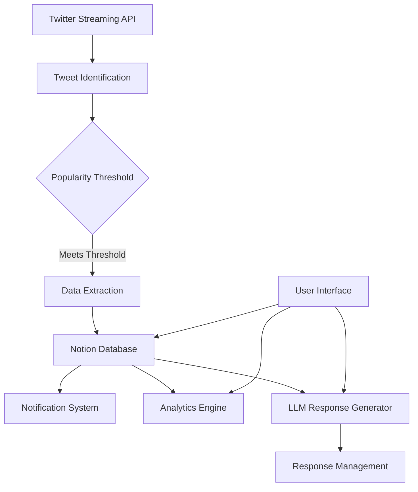
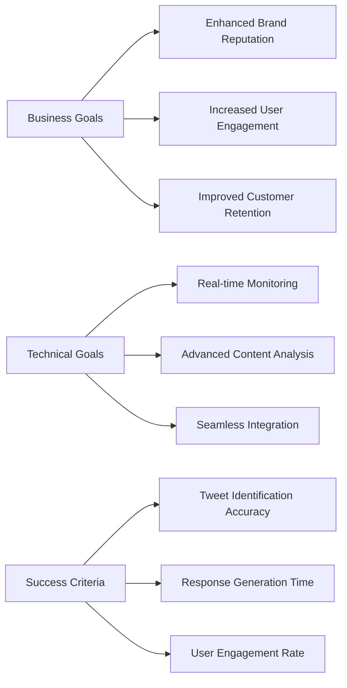
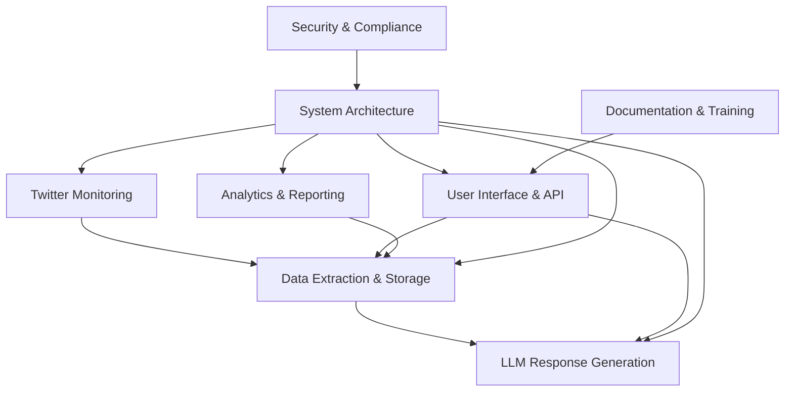
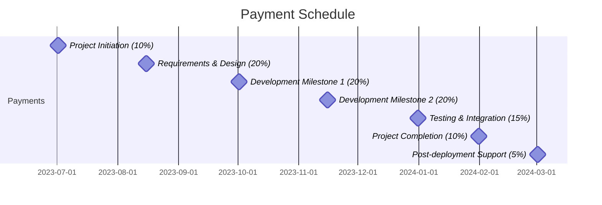
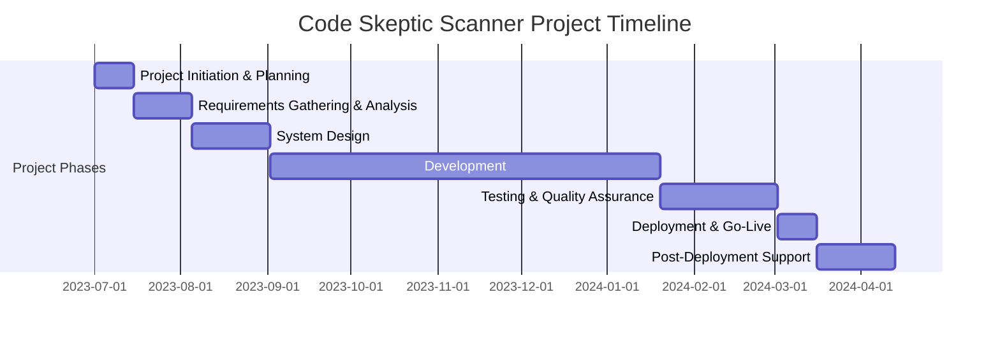
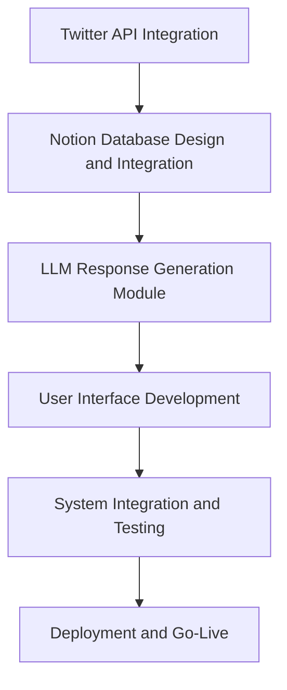

# EXECUTIVE SUMMARY

## PROJECT OVERVIEW

Code Skeptic Scanner is a cloud-based solution designed to monitor, analyze, and respond to skeptical or negative opinions about AI coding tools on Twitter/X in real-time. This innovative system addresses the growing need for companies in the AI coding tool space to stay informed about public sentiment and engage with users effectively.

The solution utilizes Twitter's Streaming API to identify relevant tweets, analyzes their content using advanced algorithms, and stores the information in a Notion database. Additionally, it employs Large Language Model (LLM) technology to generate appropriate responses to these tweets, enabling timely and context-aware engagement.

## OBJECTIVES

1. Real-time monitoring of Twitter for skeptical opinions about AI coding tools
2. Automated analysis and storage of relevant tweet data in a Notion database
3. Generation of appropriate responses using LLM technology
4. Provision of a user-friendly interface for managing and customizing the system
5. Delivery of actionable insights through analytics and trend tracking
6. Ensuring scalability, high availability, and GDPR compliance

## VALUE PROPOSITION

Our agency offers a unique combination of expertise and technology to deliver an unparalleled solution for monitoring and engaging with AI coding tool skepticism:

1. Cutting-edge integration: Seamless combination of Twitter API, Notion database, and LLM technology
2. Real-time capabilities: Instant identification and response to relevant tweets
3. Customizable analytics: In-depth insights into trends and patterns of AI coding tool skepticism
4. User-centric design: Intuitive interface for easy management and customization
5. Scalable architecture: Ability to handle high volumes of data without compromising performance
6. Compliance-focused: Built with GDPR compliance and Twitter's terms of service in mind
7. Comprehensive solution: All-in-one platform for monitoring, analysis, and engagement



This comprehensive solution will empower our client to stay ahead of the curve in understanding and addressing skepticism about AI coding tools, fostering better engagement with their audience and informing product development strategies.

## PROJECT OBJECTIVES

### BUSINESS GOALS

1. Enhance brand reputation management for AI coding tool companies
2. Increase user engagement and trust in AI coding tools
3. Improve customer retention rates for AI coding tool products
4. Inform product development strategies based on real-time user feedback
5. Reduce response time to user concerns and skepticism
6. Increase market share in the AI coding tool industry

### TECHNICAL GOALS

1. Develop a robust, real-time tweet monitoring system using Twitter's Streaming API
2. Implement an advanced content analysis algorithm to accurately identify skeptical or negative opinions about AI coding tools
3. Create a seamless integration between Twitter data, Notion database, and LLM technology
4. Design and implement a scalable cloud-based architecture capable of handling high volumes of data
5. Develop a user-friendly interface for system management and customization
6. Implement secure and GDPR-compliant data handling processes
7. Create an analytics engine for trend tracking and insight generation

### SUCCESS CRITERIA

| Criterion | Target | Measurement Method |
|-----------|--------|---------------------|
| Tweet identification accuracy | >95% | Manual review of a sample set |
| Response generation time | <30 seconds | System logs and performance metrics |
| User engagement rate | >25% increase | Comparison of pre and post-implementation engagement metrics |
| System uptime | 99.9% | Monitoring tools and incident reports |
| User satisfaction with UI | >85% positive feedback | User surveys and usability testing |
| Data processing capacity | >10,000 tweets/hour | Load testing and performance monitoring |
| Reduction in negative sentiment | 20% decrease over 6 months | Sentiment analysis of stored tweet data |
| API response time | <100ms for 95% of requests | Performance monitoring tools |



This comprehensive set of objectives and success criteria will guide the development and implementation of the Code Skeptic Scanner, ensuring that both business and technical goals are met while providing clear metrics for measuring the project's success.

# SCOPE OF WORK

## IN-SCOPE

1. Twitter Monitoring System
   - Implement real-time monitoring of Twitter's Streaming API
   - Develop algorithms to identify tweets expressing skepticism or negative opinions about AI coding tools
   - Create a popularity threshold mechanism based on likes and/or follower count

2. Data Extraction and Storage
   - Extract relevant information from identified tweets
   - Design and implement a Notion database for storing tweet data
   - Develop a system for issuing Notion notifications when new tweets are added

3. LLM-based Response Generation
   - Implement a 'responses' module using LLM technology
   - Develop algorithms for generating context-appropriate responses to identified tweets

4. User Interface and API
   - Create a user-friendly interface for system management and customization
   - Develop an API for adjusting parameters and manually triggering responses
   - Implement features for managing context and prompts
   - Embed the Notion database within the UI
   - Provide links to original tweets

5. Analytics and Reporting
   - Develop analytics features to track trends in AI coding tool skepticism over time
   - Create customizable reports and dashboards

6. System Architecture and Performance
   - Design and implement a scalable cloud-based architecture
   - Ensure high availability and real-time updates
   - Implement robust error handling and logging mechanisms

7. Security and Compliance
   - Implement GDPR-compliant data handling processes
   - Ensure adherence to Twitter's terms of service

8. Documentation and Training
   - Provide comprehensive system documentation
   - Deliver user training materials and sessions



## OUT-OF-SCOPE

1. Development of custom LLM models (will use existing models)
2. Integration with social media platforms other than Twitter
3. Automated posting of responses to Twitter (responses will be generated but not automatically posted)
4. Historical data analysis beyond the project start date
5. Development of mobile applications (focus will be on web-based interface)
6. Sentiment analysis for languages other than English
7. Integration with customer support or CRM systems
8. Automated content creation for marketing purposes

## ASSUMPTIONS

1. Twitter's Streaming API will remain available and compatible throughout the project duration
2. The client will provide necessary access to Twitter developer accounts and API keys
3. The client has an active Notion workspace and will provide required access permissions
4. The chosen LLM service will have consistent availability and performance
5. The client will provide timely feedback and approvals during the development process
6. The project team will have continuous access to necessary cloud resources and development tools
7. The client's team members are familiar with basic concepts of AI and machine learning
8. The volume of relevant tweets will be within the initially estimated range

## DEPENDENCIES

| Dependency | Description | Potential Impact |
|------------|-------------|-------------------|
| Twitter API | Access to Twitter's Streaming API | Critical for real-time monitoring; changes or downtime could affect core functionality |
| Notion API | Integration with Notion for data storage | Essential for data management; API changes could require system updates |
| LLM Service | Availability of chosen LLM for response generation | Crucial for response functionality; service interruptions could impact system performance |
| Cloud Infrastructure | Reliability of chosen cloud provider | Affects overall system availability and scalability |
| Third-party Libraries | Various libraries for data processing and analysis | Updates or deprecations may require code modifications |
| Client Resources | Timely provision of necessary information and approvals | Could impact project timeline if delayed |
| Legal Compliance | Ongoing compliance with GDPR and Twitter's terms of service | Changes in regulations or terms may require system adjustments |
| Internet Connectivity | Stable internet connection for real-time operations | Interruptions could affect system responsiveness and data accuracy |

This scope of work outlines the key components, limitations, assumptions, and dependencies of the Code Skeptic Scanner project. It provides a clear framework for project execution while acknowledging potential external factors that may influence the development process.

# BUDGET AND COST ESTIMATES

## COST BREAKDOWN

The following table provides a detailed breakdown of the project costs for the Code Skeptic Scanner:

| Category | Item | Quantity | Unit Cost | Total Cost |
|----------|------|----------|-----------|------------|
| Labor | Project Manager | 480 hours | $100/hour | $48,000 |
| Labor | Senior Software Engineer | 960 hours | $120/hour | $115,200 |
| Labor | Software Engineer | 1440 hours | $90/hour | $129,600 |
| Labor | UI/UX Designer | 320 hours | $85/hour | $27,200 |
| Labor | QA Specialist | 320 hours | $75/hour | $24,000 |
| Infrastructure | Cloud Services (AWS) | 12 months | $2,000/month | $24,000 |
| Software | Twitter API (Enterprise) | 1 year | $30,000/year | $30,000 |
| Software | Notion API | 1 year | $20/user/month (5 users) | $1,200 |
| Software | LLM API (e.g., OpenAI) | Estimated usage | - | $15,000 |
| Software | Development Tools and Licenses | Various | - | $5,000 |
| Miscellaneous | Training and Documentation | - | - | $10,000 |
| Miscellaneous | Contingency (10%) | - | - | $42,920 |

**Total Estimated Project Cost: $472,120**

## PAYMENT SCHEDULE

The proposed payment schedule is tied to project milestones and deliverables:

1. Project Initiation (10%): $47,212
   - Due upon contract signing

2. Requirements and Design Phase Completion (20%): $94,424
   - Due upon approval of detailed project requirements and system design documents

3. Development Milestone 1 (20%): $94,424
   - Due upon completion of Twitter monitoring system and data extraction to Notion

4. Development Milestone 2 (20%): $94,424
   - Due upon completion of LLM response generation and user interface

5. Testing and Integration (15%): $70,818
   - Due upon successful integration testing and user acceptance testing

6. Project Completion and Deployment (10%): $47,212
   - Due upon successful deployment and handover

7. Post-deployment Support (5%): $23,606
   - Due 30 days after successful deployment, contingent on system stability



## BUDGET CONSIDERATIONS

Several factors could potentially impact the budget, and we have strategies in place to manage these risks:

1. Twitter API Changes:
   - Risk: Twitter may modify its API or pricing structure.
   - Mitigation: We've included a contingency fund and will closely monitor Twitter's developer announcements.

2. LLM API Usage:
   - Risk: Actual usage may exceed or fall below estimates.
   - Mitigation: We'll implement usage monitoring and adjust our estimates in real-time.

3. Cloud Infrastructure Costs:
   - Risk: Costs may increase with higher than expected data volumes.
   - Mitigation: We'll use auto-scaling and implement cost optimization strategies.

4. Scope Creep:
   - Risk: Additional features may be requested during development.
   - Mitigation: We'll use a change management process and adjust the budget if necessary.

5. Integration Challenges:
   - Risk: Unforeseen difficulties in integrating multiple technologies.
   - Mitigation: We've allocated additional time for integration and testing.

6. Currency Fluctuations:
   - Risk: For international services, exchange rates may impact costs.
   - Mitigation: We'll use forward contracts or build in a forex contingency.

7. Regulatory Changes:
   - Risk: New data protection laws may require system modifications.
   - Mitigation: We'll stay informed about upcoming regulations and have allocated funds for compliance.

To manage these considerations:

- We will conduct monthly budget reviews.
- Any potential overruns will be communicated promptly.
- We'll maintain a detailed risk register and update it regularly.
- We've included a 10% contingency fund in the total budget.

By proactively addressing these budget considerations, we aim to deliver the Code Skeptic Scanner within the estimated budget while maintaining flexibility to address unforeseen challenges.

# TIMELINE AND MILESTONES

## PROJECT TIMELINE

The Code Skeptic Scanner project will be executed over a period of 9 months, divided into the following major phases:

1. Project Initiation and Planning: 2 weeks
2. Requirements Gathering and Analysis: 3 weeks
3. System Design: 4 weeks
4. Development: 20 weeks
5. Testing and Quality Assurance: 6 weeks
6. Deployment and Go-Live: 2 weeks
7. Post-Deployment Support and Optimization: 4 weeks



## KEY MILESTONES

| Milestone | Description | Estimated Completion Date |
|-----------|-------------|---------------------------|
| M1 | Project Kickoff | Week 1 |
| M2 | Requirements Sign-off | Week 5 |
| M3 | System Design Approval | Week 9 |
| M4 | Twitter Monitoring System Complete | Week 17 |
| M5 | Notion Integration Complete | Week 21 |
| M6 | LLM Response Generation Module Complete | Week 25 |
| M7 | User Interface and API Complete | Week 29 |
| M8 | Testing Phase Completion | Week 35 |
| M9 | System Deployment and Go-Live | Week 37 |
| M10 | Post-Deployment Review | Week 41 |

## CRITICAL PATH

The following tasks and activities are critical to keeping the project on schedule:

1. Twitter API Integration: Establishing a stable connection with Twitter's Streaming API is crucial for the core functionality of the system.

2. Notion Database Design and Integration: The Notion database serves as the central repository for all collected data, making its design and integration critical for subsequent phases.

3. LLM Response Generation Module: This module is essential for generating appropriate responses to identified tweets and requires careful development and testing.

4. User Interface Development: The UI is critical for user adoption and efficient system management.

5. System Integration and Testing: Ensuring all components work together seamlessly is crucial for the overall functionality of the Code Skeptic Scanner.



To maintain the project timeline, special attention will be given to these critical path items:

- Early initiation of Twitter API integration to address any potential challenges
- Parallel development of the Notion integration and LLM response generation module where possible
- Regular integration tests throughout the development phase to identify and resolve issues early
- Allocation of additional resources to critical path tasks if delays are anticipated
- Weekly status meetings to monitor progress on critical path items and adjust timelines if necessary

By focusing on these critical path elements and maintaining flexibility in resource allocation, we aim to keep the project on track and deliver the Code Skeptic Scanner within the proposed timeline.

# DELIVERABLES

## LIST OF DELIVERABLES

1. Software Components
   - Twitter Monitoring System
   - Data Extraction and Storage Module
   - Notion Database Integration
   - LLM-based Response Generation Module
   - User Interface and API
   - Analytics and Reporting Engine

2. Documentation
   - System Architecture Document
   - Technical Specifications
   - User Manual
   - API Documentation
   - Database Schema Documentation

3. Training Materials
   - User Training Guide
   - Video Tutorials
   - Administrator Training Manual

4. Deployment Package
   - Deployment Guide
   - Configuration Files
   - Environment Setup Scripts

5. Testing Artifacts
   - Test Plans
   - Test Cases
   - Test Results Report

6. Project Management Artifacts
   - Project Plan
   - Risk Register
   - Status Reports

## DELIVERY SCHEDULE

| Deliverable | Expected Delivery Date |
|-------------|------------------------|
| Project Plan | Week 2 |
| System Architecture Document | Week 9 |
| Twitter Monitoring System | Week 17 |
| Data Extraction and Storage Module | Week 21 |
| Notion Database Integration | Week 21 |
| LLM-based Response Generation Module | Week 25 |
| User Interface and API | Week 29 |
| Analytics and Reporting Engine | Week 33 |
| Technical Specifications | Week 33 |
| Test Plans and Cases | Week 34 |
| User Manual | Week 35 |
| API Documentation | Week 35 |
| Training Materials | Week 36 |
| Deployment Package | Week 37 |
| Test Results Report | Week 37 |
| Final Status Report | Week 41 |

```mermaid
gantt
    title Delivery Schedule
    dateFormat  YYYY-WW
    section Software Components
    Twitter Monitoring System       :active, 2023-17, 1w
    Data Extraction & Storage       :active, 2023-21, 1w
    Notion Integration              :active, 2023-21, 1w
    LLM Response Generation         :active, 2023-25, 1w
    User Interface and API          :active, 2023-29, 1w
    Analytics Engine                :active, 2023-33, 1w
    section Documentation
    System Architecture Doc         :done, 2023-09, 1w
    Technical Specifications        :active, 2023-33, 1w
    User Manual                     :active, 2023-35, 1w
    API Documentation               :active, 2023-35, 1w
    section Training & Deployment
    Training Materials              :active, 2023-36, 1w
    Deployment Package              :active, 2023-37, 1w
    section Testing
    Test Plans and Cases            :active, 2023-34, 1w
    Test Results Report             :active, 2023-37, 1w
```

## ACCEPTANCE CRITERIA

1. Twitter Monitoring System
   - Successfully connects to Twitter's Streaming API
   - Accurately identifies tweets expressing skepticism about AI coding tools
   - Processes at least 10,000 tweets per hour
   - Maintains 99.9% uptime

2. Data Extraction and Storage Module
   - Correctly extracts all required information from tweets
   - Stores data in the Notion database with 100% accuracy
   - Handles concurrent write operations without data loss

3. Notion Database Integration
   - Seamlessly integrates with the Notion API
   - Issues notifications for new tweets within 30 seconds
   - Allows for easy querying and filtering of stored data

4. LLM-based Response Generation Module
   - Generates contextually appropriate responses
   - Produces responses within 30 seconds of tweet identification
   - Achieves a relevance score of at least 8/10 as judged by human reviewers

5. User Interface and API
   - Intuitive and responsive user interface
   - API endpoints respond within 100ms for 95% of requests
   - Supports all specified functionalities (parameter adjustment, manual response triggering, etc.)
   - Compatible with latest versions of Chrome, Firefox, and Safari browsers

6. Analytics and Reporting Engine
   - Provides accurate trend analysis over time
   - Generates customizable reports
   - Updates in real-time with new data

7. Documentation
   - Comprehensive and accurate
   - Follows agreed-upon documentation standards
   - Reviewed and approved by technical team lead

8. Training Materials
   - Covers all system functionalities
   - Includes hands-on exercises
   - Receives a satisfaction score of at least 4/5 from test users

9. Deployment Package
   - Allows for successful deployment in client's environment
   - Includes all necessary configuration files and scripts
   - Deployment can be completed within 4 hours

10. Testing Artifacts
    - Test coverage of at least 90% for all code
    - All critical and high-priority bugs resolved
    - Performance tests demonstrate system meets or exceeds specified requirements

Each deliverable will be subject to a formal review process. The client will have 5 business days to review and provide feedback or approval for each deliverable. Any issues or discrepancies will be addressed within 3 business days of receiving feedback. Final acceptance of the entire system will be contingent upon successful completion of a 2-week user acceptance testing period.