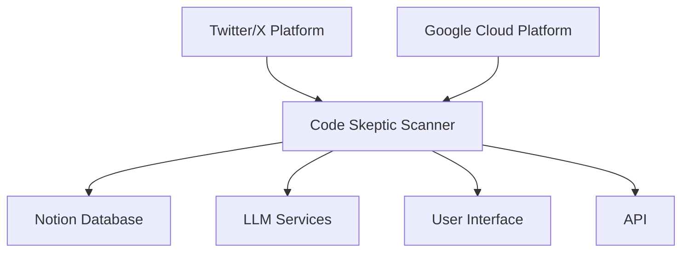
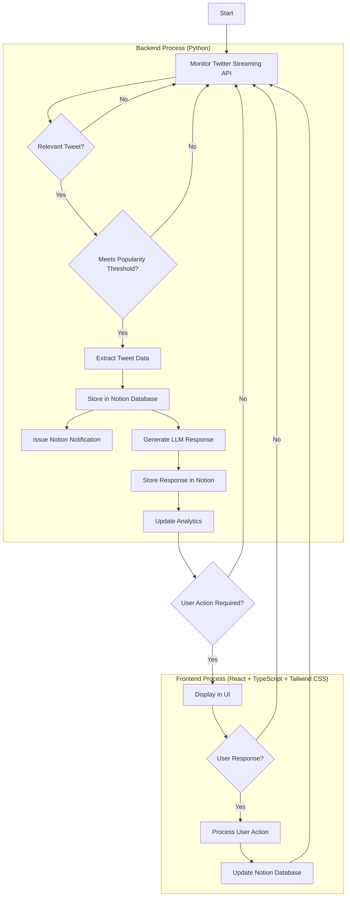
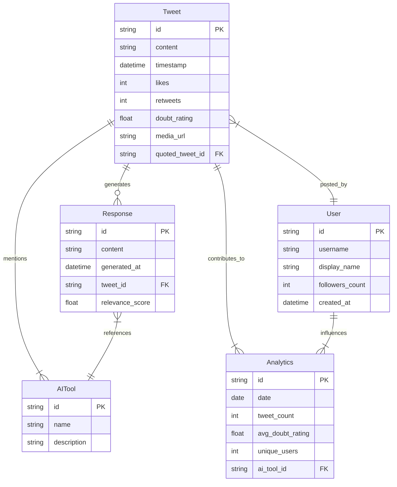
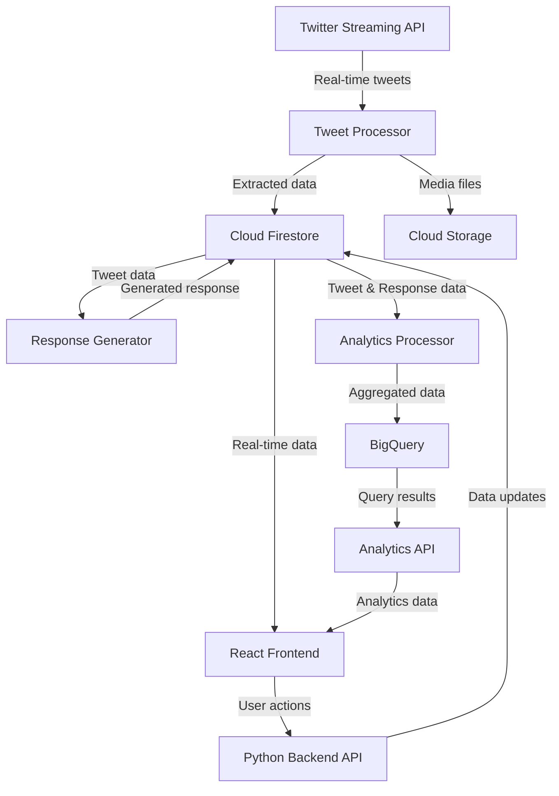
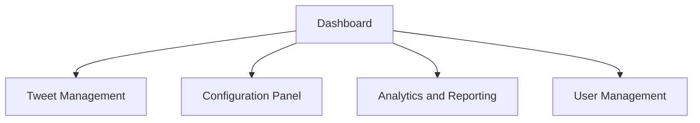
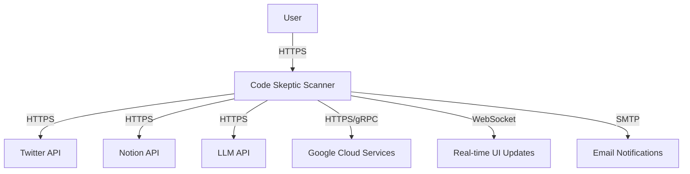

# INTRODUCTION

## PURPOSE

This Software Requirements Specification (SRS) document serves as a comprehensive description of the Code Skeptic Scanner system. Its primary purpose is to define the functional and non-functional requirements, system architecture, and design constraints for the development team, stakeholders, and project managers involved in the creation of this cloud-based solution.

The intended audience for this document includes:

1. Development Team: Software engineers, UI/UX designers, and quality assurance specialists who will implement and test the system.
2. Project Managers: To guide project planning, resource allocation, and timeline management.
3. Stakeholders: Decision-makers and investors who need to understand the system's capabilities and potential impact.
4. Client Representatives: To ensure the system meets their business needs and expectations.
5. Maintenance and Support Teams: For future reference in system updates and troubleshooting.

This SRS will serve as a foundation for the development process, providing a clear and unambiguous description of the Code Skeptic Scanner's requirements and functionalities.

## SCOPE

The Code Skeptic Scanner is a sophisticated cloud-based solution designed to monitor, analyze, and respond to skeptical or negative opinions about AI coding tools on Twitter/X in real-time. This system aims to provide valuable insights and engagement opportunities for companies in the AI coding tool space.

### Goals

1. Develop a robust real-time monitoring system for Twitter content related to AI coding tools.
2. Implement advanced analysis algorithms to identify and categorize skeptical or negative opinions.
3. Create a seamless integration between Twitter data, Notion database, and Large Language Model (LLM) technology.
4. Provide a user-friendly interface for system management and data visualization.
5. Ensure scalability and high availability to handle large volumes of data.

### Benefits

1. Enhanced brand reputation management for AI coding tool companies.
2. Improved user engagement and trust in AI coding tools.
3. Real-time insights into user concerns and market trends.
4. Efficient response generation to address user skepticism.
5. Data-driven decision-making for product development and marketing strategies.

### Core Functionalities

1. Twitter Monitoring System
   - Real-time monitoring of Twitter's Streaming API
   - Identification of tweets expressing skepticism about AI coding tools
   - Application of popularity thresholds based on likes and follower count

2. Data Extraction and Storage
   - Extraction of relevant information from identified tweets
   - Storage of tweet data in a Notion database
   - Real-time notifications for new tweet additions

3. LLM-based Response Generation
   - Automated generation of contextually appropriate responses to identified tweets
   - Integration with leading LLM technologies for high-quality response creation

4. User Interface and API
   - React-based frontend with Tailwind CSS for responsive design
   - RESTful API built with Python for backend operations
   - Features for parameter adjustment, manual response triggering, and data visualization

5. Analytics and Reporting
   - Trend analysis of AI coding tool skepticism over time
   - Customizable dashboards and reports
   - Real-time data updates and visualizations

6. Cloud Infrastructure
   - Deployment on Google Cloud Platform for scalability and reliability
   - Utilization of Google Cloud services for data processing and storage

7. Security and Compliance
   - Implementation of GDPR-compliant data handling processes
   - Adherence to Twitter's terms of service
   - Robust error handling and logging mechanisms

The Code Skeptic Scanner will provide a comprehensive solution for monitoring, analyzing, and engaging with skepticism about AI coding tools on Twitter. By leveraging cutting-edge technologies and cloud infrastructure, the system will enable companies to stay informed, responsive, and proactive in addressing user concerns and market trends.

# PRODUCT DESCRIPTION

## PRODUCT PERSPECTIVE

The Code Skeptic Scanner is a cloud-based solution designed to operate within the broader ecosystem of social media monitoring, sentiment analysis, and AI-powered engagement tools. It specifically focuses on the niche of AI coding tool sentiment on Twitter/X. The system integrates with several external services and platforms:

1. Twitter/X Platform: The primary source of data, accessed through Twitter's Streaming API.
2. Notion: Used as the central database for storing and organizing extracted tweet data.
3. Large Language Model (LLM) Services: Utilized for generating contextually appropriate responses to identified tweets.
4. Google Cloud Platform: The underlying infrastructure for hosting and scaling the application.

The system is designed to be a standalone product but can potentially integrate with other marketing and customer engagement tools in the future. It operates in real-time, continuously monitoring and analyzing Twitter data to provide up-to-date insights and engagement opportunities.

## PRODUCT FUNCTIONS

The Code Skeptic Scanner performs the following main functions:

1. Real-time Twitter Monitoring:
   - Connects to Twitter's Streaming API
   - Identifies tweets expressing skepticism about AI coding tools
   - Applies popularity thresholds based on likes and follower count

2. Data Extraction and Storage:
   - Extracts relevant information from identified tweets
   - Stores tweet data in a Notion database
   - Issues real-time notifications for new tweet additions

3. LLM-based Response Generation:
   - Generates contextually appropriate responses to identified tweets
   - Utilizes advanced LLM technology for high-quality response creation

4. User Interface and API:
   - Provides a React-based frontend with Tailwind CSS for responsive design
   - Offers a RESTful API built with Python for backend operations
   - Allows parameter adjustment, manual response triggering, and data visualization

5. Analytics and Reporting:
   - Performs trend analysis of AI coding tool skepticism over time
   - Generates customizable dashboards and reports
   - Provides real-time data updates and visualizations

6. System Management:
   - Handles user authentication and authorization
   - Manages system configurations and settings
   - Implements logging and error handling mechanisms

## USER CHARACTERISTICS

The Code Skeptic Scanner is designed for use by various roles within companies developing or marketing AI coding tools. The primary user groups include:

1. Marketing Professionals:
   - Expertise: Intermediate to advanced in social media marketing and analytics
   - Responsibilities: Monitoring brand sentiment, engaging with users, analyzing trends
   - Persona: "Marketing Manager Maria" - Experienced in digital marketing, data-driven, focused on improving brand perception and user engagement

2. Product Managers:
   - Expertise: Advanced understanding of AI coding tools and market trends
   - Responsibilities: Gathering user feedback, identifying feature requests, informing product roadmap
   - Persona: "Product Lead Peter" - Technical background, strategic thinker, keen on understanding user pain points and market demands

3. Customer Support Representatives:
   - Expertise: Intermediate knowledge of AI coding tools, strong communication skills
   - Responsibilities: Responding to user concerns, providing support and information
   - Persona: "Support Specialist Sarah" - Empathetic communicator, quick learner, focused on resolving user issues and building trust

4. Data Analysts:
   - Expertise: Advanced skills in data analysis and visualization
   - Responsibilities: Analyzing trends, generating insights, creating reports
   - Persona: "Data Analyst David" - Analytical thinker, proficient in statistical analysis, adept at translating data into actionable insights

5. System Administrators:
   - Expertise: Advanced knowledge of cloud infrastructure and system management
   - Responsibilities: Maintaining system performance, managing configurations, ensuring security
   - Persona: "SysAdmin Alex" - Technical expert, security-focused, experienced in managing cloud-based systems

## CONSTRAINTS

1. Technical Constraints:
   - Limited by Twitter's API rate limits and terms of service
   - Dependent on the availability and performance of external services (Twitter, Notion, LLM providers)
   - Must operate within the capabilities of Google Cloud Platform services

2. Regulatory Constraints:
   - Must comply with GDPR and other relevant data protection regulations
   - Needs to adhere to Twitter's developer agreement and policy

3. Performance Constraints:
   - Required to process a high volume of tweets in real-time (at least 10,000 tweets per hour)
   - Must generate responses within 30 seconds of tweet identification
   - API endpoints should respond within 100ms for 95% of requests

4. User Interface Constraints:
   - Must be compatible with the latest versions of Chrome, Firefox, and Safari browsers
   - Should be accessible and usable on both desktop and tablet devices

5. Security Constraints:
   - Must implement robust authentication and authorization mechanisms
   - Required to encrypt sensitive data in transit and at rest

6. Scalability Constraints:
   - Should be able to scale to handle increasing data volumes without significant performance degradation

7. Budget Constraints:
   - Development and operational costs must remain within the allocated budget of $472,120

## ASSUMPTIONS AND DEPENDENCIES

Assumptions:

1. Twitter's Streaming API will remain available and its structure will not change significantly during the project lifecycle.
2. The volume of relevant tweets will be within the initially estimated range.
3. Users will have a basic understanding of AI coding tools and social media concepts.
4. The client will provide timely feedback and approvals during the development process.
5. The chosen LLM service will maintain consistent performance and availability.

Dependencies:

1. Twitter API: The system heavily depends on access to Twitter's Streaming API. Any changes or disruptions to this service could significantly impact functionality.

2. Notion API: Integration with Notion is crucial for data storage and organization. The system relies on Notion's API remaining stable and accessible.

3. LLM Service: The response generation module depends on the chosen LLM service. Changes in pricing, performance, or availability could affect this core feature.

4. Google Cloud Platform: The entire system infrastructure is dependent on GCP services. Any outages or service changes could impact system availability and performance.

5. Third-party Libraries: The system utilizes various open-source libraries for development. It depends on these libraries being maintained and remaining compatible with other system components.

6. Internet Connectivity: As a cloud-based solution, the system is dependent on stable internet connectivity for both its operations and user access.

7. Client Resources: The project timeline and success depend on the client providing necessary information, access to required accounts, and timely approvals.

8. Regulatory Environment: The system's compliance features depend on current data protection and privacy regulations. Any significant changes in these regulations may require system modifications.

By acknowledging these assumptions and dependencies, the development team can better manage risks and plan for potential challenges throughout the project lifecycle.

# PROCESS FLOWCHART

The following flowchart illustrates the main processes of the Code Skeptic Scanner system:

This flowchart outlines the core processes of the Code Skeptic Scanner:

1. The system continuously monitors the Twitter Streaming API for new tweets.
2. Each tweet is evaluated for relevance to AI coding tools and skepticism.
3. If relevant, the tweet is checked against the popularity threshold.
4. Tweets meeting the criteria have their data extracted and stored in the Notion database.
5. A notification is issued in Notion for each new tweet added.
6. The LLM module generates an appropriate response to the tweet.
7. The generated response is stored in the Notion database.
8. Analytics are updated to reflect the new data.
9. If user action is required, the tweet and response are displayed in the UI.
10. Users can review and optionally respond to the tweet through the UI.
11. Any user actions are processed and the Notion database is updated accordingly.

The backend processes, implemented in Python, handle the core functionality of monitoring, data processing, and integration with external services. The frontend, built with React, TypeScript, and Tailwind CSS, provides the user interface for interaction with the system and visualization of data.

This flowchart provides a high-level overview of the system's processes and can be used as a reference for development and understanding the system's workflow.

Here's a breakdown of the Code Skeptic Scanner product into features, with the requested sub-sections for each:

1. Twitter Monitoring System

ID: F001
DESCRIPTION: Real-time monitoring of Twitter's Streaming API to identify tweets expressing skepticism or negative opinions about AI coding tools.
PRIORITY: High

| Requirement ID | Requirement Description |
|----------------|--------------------------|
| F001-1 | Connect to Twitter's Streaming API using Python |
| F001-2 | Implement tweet filtering based on keywords and sentiment analysis |
| F001-3 | Apply popularity threshold based on likes and follower count |
| F001-4 | Process at least 10,000 tweets per hour |
| F001-5 | Implement error handling and reconnection logic for API disruptions |

2. Data Extraction and Storage

ID: F002
DESCRIPTION: Extract relevant information from identified tweets and store it in a Notion database.
PRIORITY: High

| Requirement ID | Requirement Description |
|----------------|--------------------------|
| F002-1 | Extract tweet metadata (account handle, followers, likes, date/time) |
| F002-2 | Extract tweet content, media, and quoted tweets |
| F002-3 | Calculate and store doubt rating for each tweet |
| F002-4 | Identify and store mentioned AI tools |
| F002-5 | Integrate with Notion API for data storage |
| F002-6 | Implement real-time Notion notifications for new tweets |

3. LLM-based Response Generation

ID: F003
DESCRIPTION: Generate contextually appropriate responses to identified tweets using LLM technology.
PRIORITY: High

| Requirement ID | Requirement Description |
|----------------|--------------------------|
| F003-1 | Integrate with chosen LLM API (e.g., OpenAI) |
| F003-2 | Develop prompt engineering for context-aware responses |
| F003-3 | Generate responses within 30 seconds of tweet identification |
| F003-4 | Store generated responses in Notion database |
| F003-5 | Implement feedback mechanism for response quality improvement |

4. User Interface and Dashboard

ID: F004
DESCRIPTION: Develop a user-friendly interface for system management, data visualization, and interaction.
PRIORITY: Medium

| Requirement ID | Requirement Description |
|----------------|--------------------------|
| F004-1 | Create responsive UI using React, TypeScript, and Tailwind CSS |
| F004-2 | Implement user authentication and authorization |
| F004-3 | Develop dashboard for real-time tweet monitoring and response management |
| F004-4 | Create interface for adjusting system parameters and thresholds |
| F004-5 | Embed Notion database view within the UI |
| F004-6 | Provide links to original tweets |

5. Analytics and Reporting

ID: F005
DESCRIPTION: Implement analytics features to track trends in AI coding tool skepticism over time.
PRIORITY: Medium

| Requirement ID | Requirement Description |
|----------------|--------------------------|
| F005-1 | Develop trend analysis algorithms in Python |
| F005-2 | Create customizable reports and visualizations using React and chart libraries |
| F005-3 | Implement real-time data updates for analytics |
| F005-4 | Provide export functionality for reports (PDF, CSV) |
| F005-5 | Implement sentiment analysis over time |

6. API Development

ID: F006
DESCRIPTION: Create a RESTful API for system integration and external access to functionalities.
PRIORITY: Medium

| Requirement ID | Requirement Description |
|----------------|--------------------------|
| F006-1 | Develop RESTful API using Python (Flask or FastAPI) |
| F006-2 | Implement endpoints for tweet data retrieval |
| F006-3 | Create endpoints for manually triggering responses |
| F006-4 | Develop endpoints for system configuration management |
| F006-5 | Implement API authentication and rate limiting |

7. Cloud Infrastructure Setup

ID: F007
DESCRIPTION: Set up and configure cloud infrastructure for hosting the application.
PRIORITY: High

| Requirement ID | Requirement Description |
|----------------|--------------------------|
| F007-1 | Set up Google Cloud Platform project |
| F007-2 | Configure Google Kubernetes Engine for application deployment |
| F007-3 | Set up Cloud Storage for data backups |
| F007-4 | Implement Cloud Monitoring for system health checks |
| F007-5 | Configure Cloud CDN for optimized content delivery |

8. Security and Compliance

ID: F008
DESCRIPTION: Implement security measures and ensure GDPR compliance.
PRIORITY: High

| Requirement ID | Requirement Description |
|----------------|--------------------------|
| F008-1 | Implement data encryption at rest and in transit |
| F008-2 | Set up secure user authentication using Google Cloud Identity |
| F008-3 | Implement role-based access control (RBAC) |
| F008-4 | Ensure GDPR compliance in data handling and storage |
| F008-5 | Implement audit logging for system actions |

9. Error Handling and Logging

ID: F009
DESCRIPTION: Implement robust error handling and logging mechanisms.
PRIORITY: Medium

| Requirement ID | Requirement Description |
|----------------|--------------------------|
| F009-1 | Implement centralized error handling in Python backend |
| F009-2 | Set up error logging using Google Cloud Logging |
| F009-3 | Develop error notification system for critical issues |
| F009-4 | Implement client-side error tracking in React application |
| F009-5 | Create an error dashboard for monitoring and analysis |

10. System Administration Tools

ID: F010
DESCRIPTION: Develop tools for system administration and maintenance.
PRIORITY: Low

| Requirement ID | Requirement Description |
|----------------|--------------------------|
| F010-1 | Create admin panel for system configuration |
| F010-2 | Implement user management interface |
| F010-3 | Develop backup and restore functionality |
| F010-4 | Create system health monitoring dashboard |
| F010-5 | Implement automated system updates and patches |

This breakdown provides a comprehensive overview of the Code Skeptic Scanner's features, aligning with the previously established technology stack and project requirements. Each feature is prioritized and includes a detailed table of functional requirements to guide development and testing processes.

# NON-FUNCTIONAL REQUIREMENTS

## PERFORMANCE

1. Response Time
   - The system shall respond to user interactions within 100ms for 95% of requests.
   - API endpoints shall respond within 200ms for 99% of requests.
   - Tweet processing and analysis shall be completed within 5 seconds of receipt.

2. Throughput
   - The system shall be capable of processing at least 10,000 tweets per hour.
   - The LLM-based response generation module shall generate at least 100 responses per minute.

3. Resource Usage
   - The system shall utilize no more than 80% of allocated CPU resources during peak loads.
   - Memory usage shall not exceed 16GB for the backend services.
   - Database queries shall be optimized to execute within 50ms for 90% of requests.

## SAFETY

1. Data Backup
   - The system shall perform automated backups of the Notion database every 6 hours.
   - Backups shall be stored in Google Cloud Storage with versioning enabled.

2. Fault Tolerance
   - The system shall implement automatic failover mechanisms for critical components.
   - In case of a component failure, the system shall continue to operate with degraded functionality rather than complete shutdown.

3. Error Handling
   - The system shall log all errors and exceptions in Google Cloud Logging.
   - Critical errors shall trigger automated alerts to the development team.

4. Data Integrity
   - The system shall implement data validation checks to ensure the integrity of stored information.
   - Transactions shall be atomic to prevent partial updates in case of system failures.

## SECURITY

1. Authentication
   - The system shall use Google Cloud Identity for user authentication.
   - Multi-factor authentication shall be enforced for all user accounts.

2. Authorization
   - Role-based access control (RBAC) shall be implemented to manage user permissions.
   - API access shall be controlled using OAuth 2.0 tokens.

3. Data Encryption
   - All data at rest shall be encrypted using AES-256 encryption.
   - All data in transit shall be encrypted using TLS 1.3.

4. Privacy
   - The system shall comply with GDPR requirements for data protection and privacy.
   - Personal data shall be anonymized or pseudonymized where possible.

5. Security Monitoring
   - The system shall implement intrusion detection and prevention systems.
   - Regular security audits and penetration testing shall be conducted.

## QUALITY

1. Availability
   - The system shall maintain 99.9% uptime, excluding scheduled maintenance.
   - Scheduled maintenance shall not exceed 4 hours per month and shall be performed during off-peak hours.

2. Maintainability
   - The codebase shall adhere to established coding standards for Python, TypeScript, and React.
   - The system shall use modular architecture to facilitate easy updates and maintenance.
   - Comprehensive documentation shall be maintained for all system components.

3. Usability
   - The user interface shall be responsive and compatible with the latest versions of Chrome, Firefox, and Safari browsers.
   - The system shall provide clear error messages and user guidance.
   - The UI shall be designed following accessibility guidelines (WCAG 2.1 AA compliance).

4. Scalability
   - The system shall be designed to scale horizontally to handle increased load.
   - Google Kubernetes Engine shall be used for container orchestration to facilitate easy scaling.

5. Reliability
   - The system shall have a mean time between failures (MTBF) of at least 720 hours.
   - The system shall have a mean time to recovery (MTTR) of less than 30 minutes.

## COMPLIANCE

1. Legal Compliance
   - The system shall comply with all applicable data protection laws, including GDPR and CCPA.
   - The system shall adhere to Twitter's Developer Agreement and Policy.

2. Regulatory Compliance
   - The system shall implement logging and auditing features to support regulatory requirements.
   - All data retention and deletion policies shall comply with relevant regulations.

3. Standards Compliance
   - The system shall adhere to OWASP security standards for web applications.
   - The API shall follow RESTful design principles and OpenAPI Specification 3.0.

4. Ethical Compliance
   - The system shall implement measures to prevent misuse for spam or harassment.
   - The LLM-based response generation shall adhere to ethical AI principles, avoiding biased or inappropriate content.

5. Accessibility Compliance
   - The user interface shall comply with WCAG 2.1 Level AA standards.
   - The system shall support keyboard navigation and screen reader compatibility.

These non-functional requirements provide a comprehensive framework for ensuring the Code Skeptic Scanner meets high standards of performance, safety, security, quality, and compliance. They align with the previously established technology stack, including TypeScript, React, and Tailwind CSS for the frontend, Python for the backend, and Google Cloud solutions for infrastructure and services.

# DATA REQUIREMENTS

## DATA MODELS

The Code Skeptic Scanner system will utilize the following data models:

1. Tweet
2. User
3. Response
4. AITool
5. Analytics

Here's an entity-relationship diagram representing the relationships between these models:

## DATA STORAGE

The Code Skeptic Scanner will utilize Google Cloud Platform (GCP) services for data storage, ensuring scalability, reliability, and security.

1. Primary Storage: Google Cloud Firestore
   - NoSQL document database for storing Tweet, User, Response, and AITool data
   - Provides real-time synchronization and offline support
   - Automatic scaling to handle high volumes of data

2. Analytics Data: Google BigQuery
   - Serverless data warehouse for storing and querying large-scale analytics data
   - Enables fast, SQL-like queries on massive datasets

3. Media Storage: Google Cloud Storage
   - Object storage for tweet media (images, videos)
   - Provides high durability and availability

Data Retention:
- Tweet and Response data: 12 months
- User data: For the duration of the project, subject to user deletion requests
- Analytics data: 36 months
- Media files: 6 months

Redundancy and Backup:
- Utilize Google Cloud's multi-region deployment for Firestore and Cloud Storage
- Daily backups of Firestore data to Cloud Storage
- Weekly exports of BigQuery datasets to Cloud Storage

Recovery:
- Implement point-in-time recovery for Firestore (up to 7 days)
- Utilize BigQuery's table snapshot feature for analytics data recovery
- Develop automated scripts for restoring data from Cloud Storage backups

## DATA PROCESSING

The Code Skeptic Scanner will implement a robust data processing pipeline to ensure efficient and secure handling of data.

Data Security:
1. Encryption:
   - Data at rest: Use Google Cloud's default encryption for Firestore, BigQuery, and Cloud Storage
   - Data in transit: Enforce HTTPS for all API communications

2. Access Control:
   - Implement Identity and Access Management (IAM) roles for fine-grained access control
   - Use service accounts with minimal necessary permissions for backend services

3. Data Anonymization:
   - Implement data anonymization techniques for analytics data to protect user privacy

4. Audit Logging:
   - Enable Cloud Audit Logs to track data access and modifications

Data Flow:

Data Processing Steps:
1. Tweet Processor:
   - Connects to Twitter Streaming API
   - Filters tweets based on relevance criteria
   - Extracts required information
   - Stores tweet data in Firestore and media in Cloud Storage

2. Response Generator:
   - Retrieves relevant tweet data from Firestore
   - Utilizes LLM API to generate appropriate responses
   - Stores generated responses in Firestore

3. Analytics Processor:
   - Aggregates tweet and response data from Firestore
   - Processes data to generate analytics insights
   - Stores aggregated data in BigQuery

4. Backend API:
   - Handles CRUD operations on Firestore data
   - Processes user actions from the frontend
   - Implements business logic and data validation

5. Frontend:
   - Retrieves real-time data from Firestore
   - Fetches analytics data from BigQuery through the Analytics API
   - Renders data and provides user interface for interaction

By implementing this data processing pipeline, the Code Skeptic Scanner ensures efficient, secure, and scalable handling of data throughout the system.

# EXTERNAL INTERFACES

## USER INTERFACES

The Code Skeptic Scanner will feature a web-based user interface built using React, TypeScript, and Tailwind CSS. The UI will be responsive, accessible, and optimized for desktop and tablet devices. The following key interfaces will be implemented:

1. Dashboard
   - Real-time display of identified tweets
   - Analytics overview with key metrics
   - Quick access to main functionalities

2. Tweet Management Interface
   - List view of identified tweets with filtering and sorting options
   - Detailed view of individual tweets with associated metadata
   - Interface for manually triggering LLM responses

3. Configuration Panel
   - Settings for adjusting tweet identification parameters
   - LLM response generation configuration
   - Twitter API and Notion integration settings

4. Analytics and Reporting Interface
   - Interactive charts and graphs for trend analysis
   - Custom report generation tools
   - Data export functionality

5. User Management Interface
   - User profile management
   - Role-based access control settings

Placeholder for UI mockups:
[Dashboard Mockup]
[Tweet Management Interface Mockup]
[Configuration Panel Mockup]
[Analytics Interface Mockup]
[User Management Interface Mockup]

## SOFTWARE INTERFACES

The Code Skeptic Scanner will interact with several external software systems:

1. Twitter API
   - Interface: REST API and Streaming API
   - Purpose: Real-time tweet monitoring and data retrieval
   - Data Format: JSON
   - Protocol: HTTPS

2. Notion API
   - Interface: REST API
   - Purpose: Data storage and retrieval
   - Data Format: JSON
   - Protocol: HTTPS

3. LLM API (e.g., OpenAI GPT-3)
   - Interface: REST API
   - Purpose: Generation of responses to tweets
   - Data Format: JSON
   - Protocol: HTTPS

4. Google Cloud Services
   - Google Kubernetes Engine (GKE)
     - Purpose: Application deployment and scaling
     - Interface: Kubernetes API
   - Cloud Storage
     - Purpose: Storage of media files and backups
     - Interface: Cloud Storage API
   - Cloud Logging
     - Purpose: Centralized logging
     - Interface: Cloud Logging API
   - Cloud Monitoring
     - Purpose: System performance monitoring
     - Interface: Cloud Monitoring API

5. Authentication Service (Google Cloud Identity)
   - Interface: OAuth 2.0
   - Purpose: User authentication and authorization

## COMMUNICATION INTERFACES

The Code Skeptic Scanner will utilize the following communication interfaces:

1. HTTPS
   - Purpose: Secure communication for all external API interactions and user interface access
   - Protocol: TLS 1.3
   - Port: 443

2. WebSocket
   - Purpose: Real-time updates for the user interface
   - Protocol: WSS (WebSocket Secure)
   - Port: 443

3. gRPC
   - Purpose: Internal communication between microservices
   - Protocol: HTTP/2
   - Data Format: Protocol Buffers

4. SMTP
   - Purpose: Sending email notifications
   - Protocol: SMTP over TLS
   - Port: 587

Data Formats:
- JSON: Used for most API communications and data storage
- Protocol Buffers: Used for efficient internal service communication
- CSV: Used for data exports in the analytics module

These communication interfaces ensure secure, efficient, and real-time data exchange between the Code Skeptic Scanner and its various components and external services. The use of standard protocols and data formats facilitates easy integration and maintenance of the system.

# APPENDICES

## GLOSSARY

- **AI Coding Tools**: Software applications that use artificial intelligence to assist in writing, analyzing, or optimizing code.
- **Doubt Rating**: A numerical score assigned to tweets indicating the level of skepticism or negativity towards AI coding tools.
- **Popularity Threshold**: A predefined level of engagement (likes, retweets, or follower count) that a tweet must meet to be considered for analysis.
- **Response Generation**: The process of creating contextually appropriate replies to identified tweets using LLM technology.
- **Sentiment Analysis**: The process of determining the emotional tone behind a series of words, used to gain an understanding of the attitudes, opinions, and emotions expressed in tweets.
- **Tweet Identification**: The process of detecting and filtering tweets that express skepticism or negative opinions about AI coding tools.

## ACRONYMS

- **API**: Application Programming Interface
- **CDN**: Content Delivery Network
- **CRUD**: Create, Read, Update, Delete
- **GDPR**: General Data Protection Regulation
- **GKE**: Google Kubernetes Engine
- **IAM**: Identity and Access Management
- **LLM**: Large Language Model
- **MTBF**: Mean Time Between Failures
- **MTTR**: Mean Time To Recovery
- **OWASP**: Open Web Application Security Project
- **RBAC**: Role-Based Access Control
- **REST**: Representational State Transfer
- **SRS**: Software Requirements Specification
- **TLS**: Transport Layer Security
- **UI**: User Interface
- **UX**: User Experience
- **WCAG**: Web Content Accessibility Guidelines

## ADDITIONAL REFERENCES

1. Twitter Developer Documentation:
   https://developer.twitter.com/en/docs

2. Notion API Documentation:
   https://developers.notion.com/

3. Google Cloud Documentation:
   https://cloud.google.com/docs

4. React Documentation:
   https://reactjs.org/docs/getting-started.html

5. TypeScript Documentation:
   https://www.typescriptlang.org/docs/

6. Tailwind CSS Documentation:
   https://tailwindcss.com/docs

7. Python Documentation:
   https://docs.python.org/3/

8. GDPR Official Text:
   https://gdpr-info.eu/

9. OWASP Top Ten Project:
   https://owasp.org/www-project-top-ten/

10. Web Content Accessibility Guidelines (WCAG) 2.1:
    https://www.w3.org/TR/WCAG21/

11. "Natural Language Processing with Transformers" by Lewis Tunstall, Leandro von Werra, and Thomas Wolf:
    https://www.oreilly.com/library/view/natural-language-processing/9781098136789/

12. "Designing Data-Intensive Applications" by Martin Kleppmann:
    https://dataintensive.net/

13. "Clean Architecture: A Craftsman's Guide to Software Structure and Design" by Robert C. Martin:
    https://www.pearson.com/en-us/subject-catalog/p/clean-architecture-a-craftsmans-guide-to-software-structure-and-design/P200000009228

14. Google Cloud Best Practices for Enterprise Organizations:
    https://cloud.google.com/docs/enterprise/best-practices-for-enterprise-organizations

15. "Effective TypeScript: 62 Specific Ways to Improve Your TypeScript" by Dan Vanderkam:
    https://effectivetypescript.com/

These additional references provide in-depth information on the technologies, best practices, and concepts relevant to the Code Skeptic Scanner project. They can serve as valuable resources for the development team throughout the project lifecycle.