# INTRODUCTION

## SYSTEM OVERVIEW

The Code Skeptic Scanner is a comprehensive cloud-based solution designed to monitor, analyze, and respond to skeptical or negative opinions about AI coding tools on Twitter/X in real-time. This system leverages cutting-edge technologies to provide valuable insights and engagement opportunities for companies in the AI coding tool space.

### High-Level Architecture

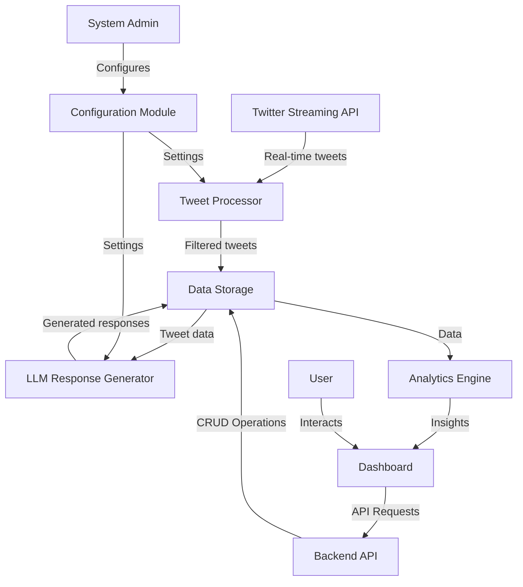

### Key Components

1. **Tweet Processor**
   - Technology: Python
   - Function: Connects to Twitter's Streaming API, filters relevant tweets, and extracts necessary information.

2. **Data Storage**
   - Technology: Google Cloud Firestore, Google Cloud Storage
   - Function: Stores tweet data, user information, generated responses, and media files.

3. **LLM Response Generator**
   - Technology: Python, Integration with LLM API (e.g., OpenAI)
   - Function: Generates contextually appropriate responses to identified tweets.

4. **Analytics Engine**
   - Technology: Python, Google BigQuery
   - Function: Processes data to generate insights and trends.

5. **Dashboard**
   - Technology: React, TypeScript, Tailwind CSS
   - Function: Provides a user interface for data visualization and system interaction.

6. **Backend API**
   - Technology: Python (FastAPI or Flask)
   - Function: Handles data operations and business logic.

7. **Configuration Module**
   - Technology: Python, React (for UI)
   - Function: Allows system administrators to adjust parameters and settings.

### Key Features

1. Real-time Twitter monitoring for AI coding tool skepticism
2. Automated response generation using LLM technology
3. Data storage and management in Google Cloud
4. Advanced analytics and trend analysis
5. User-friendly dashboard for data visualization and interaction
6. Configurable parameters for tweet identification and response generation
7. Scalable architecture using Google Kubernetes Engine
8. GDPR-compliant data handling and storage

### Integration Points

1. Twitter API: For real-time tweet monitoring and data retrieval
2. LLM API: For generating contextually appropriate responses
3. Google Cloud Services: For infrastructure, storage, and analytics
4. Notion API: For additional data storage and organization (optional)

### User Roles

1. **System Administrators**: Manage system configuration and monitor performance
2. **Analysts**: View analytics, generate reports, and derive insights
3. **Content Managers**: Review tweets and responses, manage engagement strategies
4. **Viewers**: Access read-only dashboard for high-level insights

This system overview provides a high-level understanding of the Code Skeptic Scanner's architecture, components, and functionalities. It sets the foundation for more detailed specifications in the subsequent sections of this technical document.

# SYSTEM ARCHITECTURE

## PROGRAMMING LANGUAGES

The Code Skeptic Scanner will utilize the following programming languages:

| Language   | Purpose                                      | Justification                                                                                    |
|------------|----------------------------------------------|--------------------------------------------------------------------------------------------------|
| TypeScript | Frontend development                         | Provides static typing for improved code quality and developer productivity in React applications |
| Python     | Backend development, data processing, ML/NLP | Versatile language with strong libraries for data processing, API integration, and ML/NLP tasks   |
| SQL        | Database queries                             | Standard language for querying and managing relational data in BigQuery                           |
| YAML       | Configuration files                          | Human-readable format for defining Kubernetes configurations and CI/CD pipelines                  |
| Bash       | Scripting for DevOps tasks                   | Efficient for automating deployment, testing, and maintenance tasks                               |

## HIGH-LEVEL ARCHITECTURE DIAGRAM

The following diagram provides an overview of the Code Skeptic Scanner's high-level architecture:


## COMPONENT DIAGRAMS

### Frontend Components

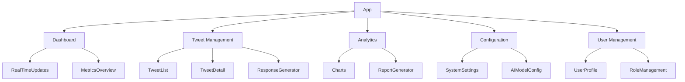

### Backend Components

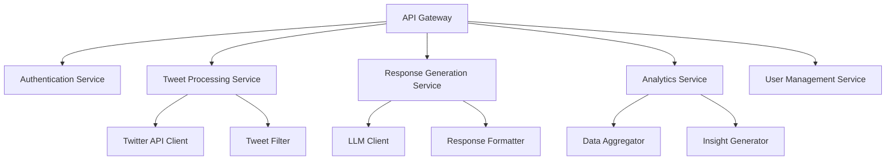

## SEQUENCE DIAGRAMS

### Tweet Processing and Response Generation

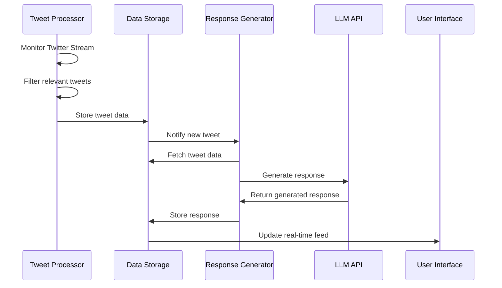

### User Interaction with Analytics

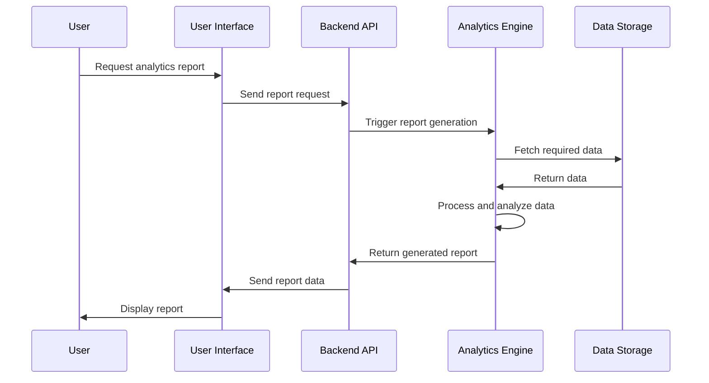

## DATA-FLOW DIAGRAM

The following diagram illustrates how information moves through the Code Skeptic Scanner system:

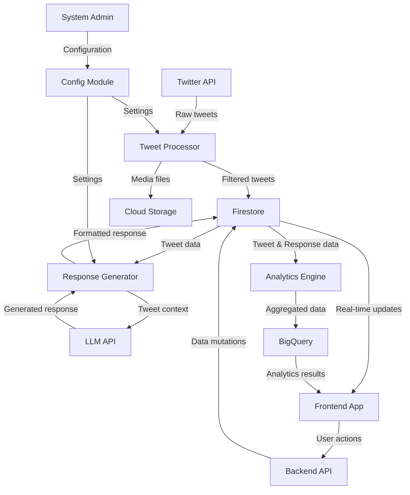

This data flow diagram shows how information moves from the Twitter API through various processing stages, storage systems, and finally to the user interface. It also illustrates how user actions and system configurations influence the data flow within the system.

# SYSTEM DESIGN

## PROGRAMMING LANGUAGES

The Code Skeptic Scanner will utilize the following programming languages:

| Language   | Purpose                                      | Justification                                                                                    |
|------------|----------------------------------------------|--------------------------------------------------------------------------------------------------|
| TypeScript | Frontend development                         | Provides static typing for improved code quality and developer productivity in React applications |
| Python     | Backend development, data processing, ML/NLP | Versatile language with strong libraries for data processing, API integration, and ML/NLP tasks   |
| SQL        | Database queries                             | Standard language for querying and managing relational data in BigQuery                           |
| YAML       | Configuration files                          | Human-readable format for defining Kubernetes configurations and CI/CD pipelines                  |
| Bash       | Scripting for DevOps tasks                   | Efficient for automating deployment, testing, and maintenance tasks                               |

## DATABASE DESIGN

The Code Skeptic Scanner will use a combination of Google Cloud Firestore (NoSQL) and Google BigQuery (SQL) for data storage. Here's an overview of the database design:

### Google Cloud Firestore (NoSQL)

Collections and Documents:

1. Tweets
   - tweet_id (string)
   - content (string)
   - user_id (string)
   - timestamp (timestamp)
   - likes_count (number)
   - retweets_count (number)
   - doubt_rating (number)
   - ai_tools (array of strings)
   - media_urls (array of strings)
   - quoted_tweet_id (string, optional)

2. Users
   - user_id (string)
   - username (string)
   - display_name (string)
   - followers_count (number)
   - created_at (timestamp)

3. Responses
   - response_id (string)
   - tweet_id (string)
   - content (string)
   - generated_at (timestamp)
   - relevance_score (number)

4. AITools
   - tool_id (string)
   - name (string)
   - description (string)

### Google BigQuery (SQL)

Tables:

1. tweet_analytics
   ```sql
   CREATE TABLE tweet_analytics (
     date DATE,
     ai_tool_id STRING,
     tweet_count INT64,
     avg_doubt_rating FLOAT64,
     unique_users INT64
   )
   PARTITION BY date
   CLUSTER BY ai_tool_id
   ```

2. user_engagement
   ```sql
   CREATE TABLE user_engagement (
     date DATE,
     user_id STRING,
     tweets_count INT64,
     avg_doubt_rating FLOAT64,
     total_likes INT64,
     total_retweets INT64
   )
   PARTITION BY date
   CLUSTER BY user_id
   ```

## API DESIGN

The Code Skeptic Scanner will use a RESTful API design for communication between the frontend and backend, as well as for external integrations. Here's an overview of the main API endpoints:

### Authentication

```
POST /api/auth/login
POST /api/auth/logout
POST /api/auth/refresh
```

### Tweets

```
GET /api/tweets
GET /api/tweets/{tweet_id}
POST /api/tweets/{tweet_id}/responses
GET /api/tweets/{tweet_id}/responses
```

### Users

```
GET /api/users
GET /api/users/{user_id}
```

### AI Tools

```
GET /api/ai-tools
GET /api/ai-tools/{tool_id}
```

### Analytics

```
GET /api/analytics/tweets
GET /api/analytics/users
GET /api/analytics/ai-tools
```

### Configuration

```
GET /api/config
PATCH /api/config
```

API Response Format:

```json
{
  "status": "success",
  "data": {},
  "message": ""
}
```

Error Response Format:

```json
{
  "status": "error",
  "error": {
    "code": "ERROR_CODE",
    "message": "Error description"
  }
}
```

## USER INTERFACE DESIGN

The Code Skeptic Scanner will feature a responsive web application built with React, TypeScript, and Tailwind CSS. Here's an overview of the main components and layouts:

### Main Layout

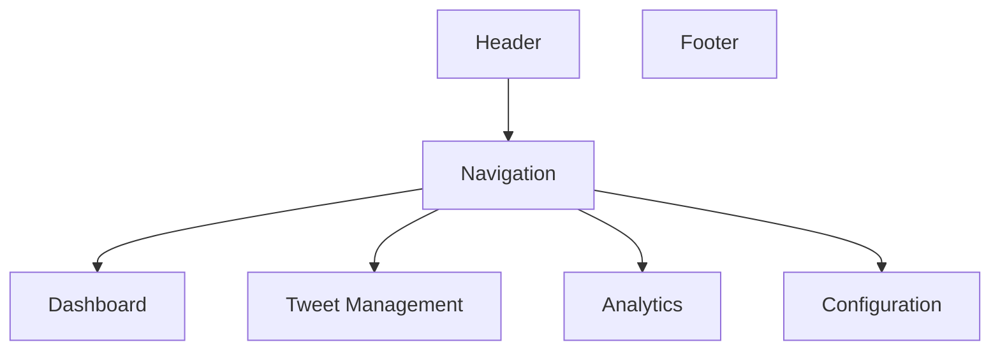

### Dashboard

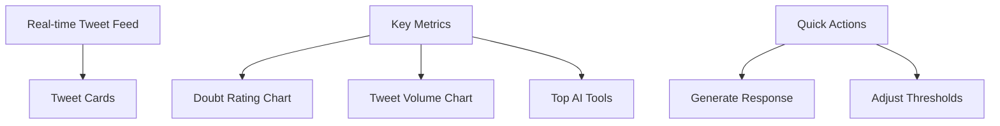

### Tweet Management

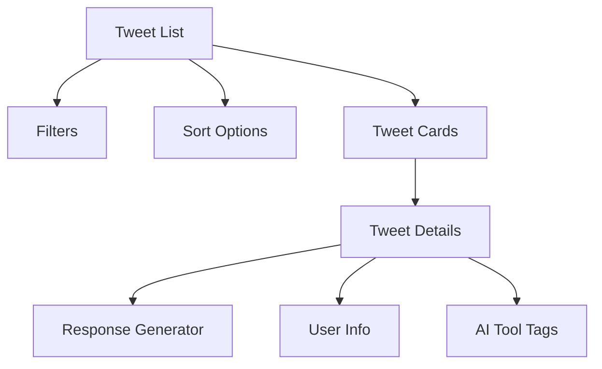

### Analytics

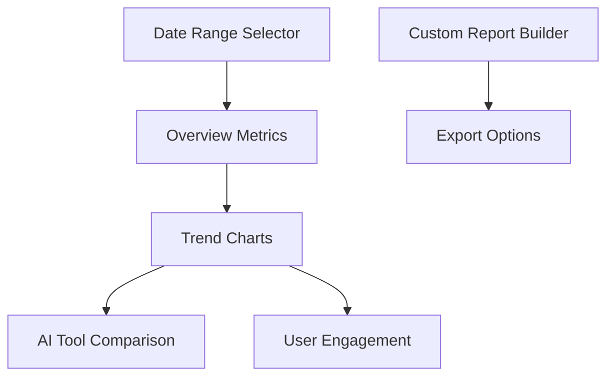

### Configuration

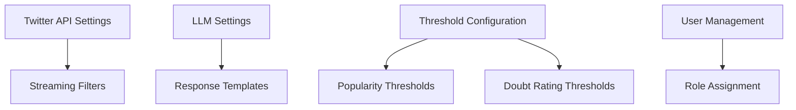

The user interface will be designed with accessibility in mind, following WCAG 2.1 AA standards. It will use a consistent color scheme and typography throughout the application, with a focus on readability and ease of use. The layout will be responsive, adapting to different screen sizes and devices, with a mobile-first approach.

Key UI Components:

1. Data Tables: For displaying tweet lists, user information, and analytics data
2. Charts: For visualizing trends and metrics using libraries like Chart.js or D3.js
3. Forms: For configuration settings and response generation
4. Modals: For displaying detailed information and confirmation dialogs
5. Tooltips: For providing additional context and guidance
6. Notifications: For alerting users to important events or actions

The UI will implement lazy loading and pagination where appropriate to ensure fast load times and smooth performance, even when dealing with large datasets. Real-time updates will be handled using WebSocket connections to provide users with the most up-to-date information without requiring manual refreshes.

# TECHNOLOGY STACK

## PROGRAMMING LANGUAGES

The Code Skeptic Scanner will utilize the following programming languages:

| Language   | Purpose                                      | Justification                                                                                    |
|------------|----------------------------------------------|--------------------------------------------------------------------------------------------------|
| TypeScript | Frontend development                         | Provides static typing for improved code quality and developer productivity in React applications |
| Python     | Backend development, data processing, ML/NLP | Versatile language with strong libraries for data processing, API integration, and ML/NLP tasks   |
| SQL        | Database queries                             | Standard language for querying and managing relational data in BigQuery                           |
| YAML       | Configuration files                          | Human-readable format for defining Kubernetes configurations and CI/CD pipelines                  |
| Bash       | Scripting for DevOps tasks                   | Efficient for automating deployment, testing, and maintenance tasks                               |

## FRAMEWORKS AND LIBRARIES

The following frameworks and libraries will be used in the development of the Code Skeptic Scanner:

| Framework/Library | Purpose                                   | Justification                                                                        |
|-------------------|-------------------------------------------|--------------------------------------------------------------------------------------|
| React             | Frontend UI development                   | Efficient component-based architecture for building interactive user interfaces       |
| Tailwind CSS      | Frontend styling                          | Utility-first CSS framework for rapid UI development and consistent design            |
| FastAPI           | Backend API development                   | High-performance Python web framework for building APIs with automatic documentation  |
| Pydantic          | Data validation and settings management   | Provides data validation and settings management using Python type annotations        |
| Tweepy            | Twitter API integration                   | Simplifies interaction with Twitter API in Python                                     |
| Pandas            | Data manipulation and analysis            | Powerful data structures and tools for efficient data processing in Python            |
| NumPy             | Numerical computing                       | Fundamental package for scientific computing in Python                                |
| Scikit-learn      | Machine learning tasks                    | Provides simple and efficient tools for data mining and data analysis in Python       |
| Transformers      | Natural Language Processing               | State-of-the-art NLP library for implementing LLM-based response generation           |
| React Query       | Data fetching and state management        | Simplifies data fetching, caching, and state management in React applications         |
| Chart.js          | Data visualization                        | Simple yet flexible JavaScript charting library for creating interactive charts       |
| Jest              | Testing framework                         | Comprehensive testing solution for JavaScript and TypeScript projects                 |
| Pytest            | Testing framework for Python              | Feature-rich testing framework for Python projects                                    |

## DATABASES

The Code Skeptic Scanner will employ the following database systems:

| Database            | Purpose                                     | Justification                                                                           |
|---------------------|---------------------------------------------|-----------------------------------------------------------------------------------------|
| Google Cloud Firestore | Primary NoSQL database                   | Flexible, scalable document database for storing tweet data, user information, and responses |
| Google BigQuery     | Data warehouse for analytics                | Serverless, highly scalable data warehouse for complex analytics and large-scale data processing |
| Google Cloud Storage | Object storage for media and backups       | Scalable and durable object storage for tweet media, backups, and large file storage    |

## THIRD-PARTY SERVICES

The following external services and APIs will be integrated into the Code Skeptic Scanner:

| Service                  | Purpose                                     | Justification                                                                    |
|--------------------------|---------------------------------------------|----------------------------------------------------------------------------------|
| Twitter API              | Real-time tweet monitoring and data retrieval | Essential for accessing Twitter's streaming data and user information             |
| Notion API               | Data storage and organization               | Provides a flexible workspace for storing and organizing extracted tweet data     |
| OpenAI GPT-3 API         | LLM-based response generation               | State-of-the-art language model for generating contextually appropriate responses |
| Google Cloud Platform    | Infrastructure and cloud services           | Comprehensive cloud platform for hosting, scaling, and managing the application   |
| Google Kubernetes Engine | Container orchestration and deployment      | Managed Kubernetes service for deploying, managing, and scaling containerized applications |
| Google Cloud Identity    | User authentication and authorization       | Secure and scalable identity and access management service                        |
| Google Cloud Monitoring  | System monitoring and alerting              | Comprehensive monitoring, logging, and diagnostics for cloud applications         |
| Google Cloud CDN         | Content delivery network                    | Global content delivery for fast, reliable user experiences                       |

This technology stack leverages modern, scalable, and efficient technologies that align with the project requirements. The combination of TypeScript and React for the frontend, Python for the backend, and Google Cloud services for infrastructure provides a robust foundation for building the Code Skeptic Scanner system.

# SECURITY CONSIDERATIONS

## AUTHENTICATION AND AUTHORIZATION

The Code Skeptic Scanner will implement a robust authentication and authorization system to ensure secure access to the application and its resources.

### Authentication

1. Google Cloud Identity Integration
   - Utilize Google Cloud Identity for user authentication
   - Implement OAuth 2.0 flow for secure token-based authentication

2. Multi-Factor Authentication (MFA)
   - Enforce MFA for all user accounts
   - Support Time-based One-Time Password (TOTP) and SMS-based verification

3. Session Management
   - Implement secure session handling using JSON Web Tokens (JWT)
   - Set appropriate token expiration times and implement refresh token mechanism

### Authorization

1. Role-Based Access Control (RBAC)
   - Implement RBAC to manage user permissions
   - Define the following roles:
     - Admin: Full system access
     - Analyst: Access to analytics and reporting features
     - Content Manager: Access to tweet management and response generation
     - Viewer: Read-only access to dashboard and reports

2. Permission Matrix

| Feature                | Admin | Analyst | Content Manager | Viewer |
|------------------------|-------|---------|-----------------|--------|
| User Management        | ✓     | ✗       | ✗               | ✗      |
| System Configuration   | ✓     | ✗       | ✗               | ✗      |
| Tweet Management       | ✓     | ✓       | ✓               | ✗      |
| Response Generation    | ✓     | ✗       | ✓               | ✗      |
| Analytics & Reporting  | ✓     | ✓       | ✓               | ✓      |
| Data Export            | ✓     | ✓       | ✗               | ✗      |

3. API Authorization
   - Implement OAuth 2.0 scopes for fine-grained API access control
   - Use API keys for external integrations with rate limiting

## DATA SECURITY

The Code Skeptic Scanner will implement comprehensive data security measures to protect sensitive information throughout its lifecycle.

1. Encryption
   - Data at Rest:
     - Use Google Cloud's default encryption for Firestore, BigQuery, and Cloud Storage
     - Implement additional application-level encryption for sensitive fields using AES-256
   - Data in Transit:
     - Enforce TLS 1.3 for all network communications
     - Implement certificate pinning for mobile applications

2. Data Classification
   - Implement a data classification system:
     - Public: Non-sensitive data
     - Internal: Business data not intended for public disclosure
     - Confidential: Sensitive business data
     - Restricted: Highly sensitive data (e.g., authentication credentials)

3. Access Controls
   - Implement least privilege principle for data access
   - Use Google Cloud IAM for managing service account permissions
   - Implement data access logging and auditing

4. Data Retention and Disposal
   - Implement automated data retention policies in compliance with GDPR
   - Securely delete data using industry-standard methods when retention period expires

5. Secure Backup and Recovery
   - Implement encrypted backups of all data stores
   - Regularly test data recovery procedures

6. Data Anonymization and Pseudonymization
   - Implement data anonymization techniques for analytics data
   - Use pseudonymization for user data where full anonymization is not possible

## SECURITY PROTOCOLS

The Code Skeptic Scanner will adhere to the following security protocols to maintain system integrity and protect against threats.

1. Secure Development Lifecycle (SDL)
   - Implement security requirements gathering
   - Conduct threat modeling during design phase
   - Perform regular code reviews and static analysis
   - Conduct penetration testing before major releases

2. Vulnerability Management
   - Implement a vulnerability scanning process using tools like Nessus or Qualys
   - Establish a responsible disclosure program for external security researchers
   - Implement a patch management process for timely vulnerability remediation

3. Incident Response Plan
   - Develop and maintain an incident response plan
   - Conduct regular tabletop exercises to test the plan
   - Implement automated alerting for security events

4. Security Monitoring and Logging
   - Utilize Google Cloud's Security Command Center for threat detection
   - Implement centralized logging using Google Cloud Logging
   - Set up real-time alerting for suspicious activities

5. Network Security
   - Implement network segmentation using Google Cloud VPC
   - Use Cloud Armor for DDoS protection and Web Application Firewall (WAF)
   - Implement intrusion detection and prevention systems (IDS/IPS)

6. Application Security
   - Implement input validation and output encoding to prevent injection attacks
   - Use Content Security Policy (CSP) headers to mitigate XSS attacks
   - Implement rate limiting to prevent abuse and brute force attacks

7. Third-Party Security
   - Conduct security assessments of third-party integrations
   - Implement vendor risk management process
   - Regularly review and update third-party permissions

8. Compliance and Auditing
   - Conduct regular security audits
   - Maintain compliance with relevant standards (e.g., GDPR, OWASP Top 10)
   - Implement automated compliance checks in CI/CD pipeline

Security Architecture Diagram:

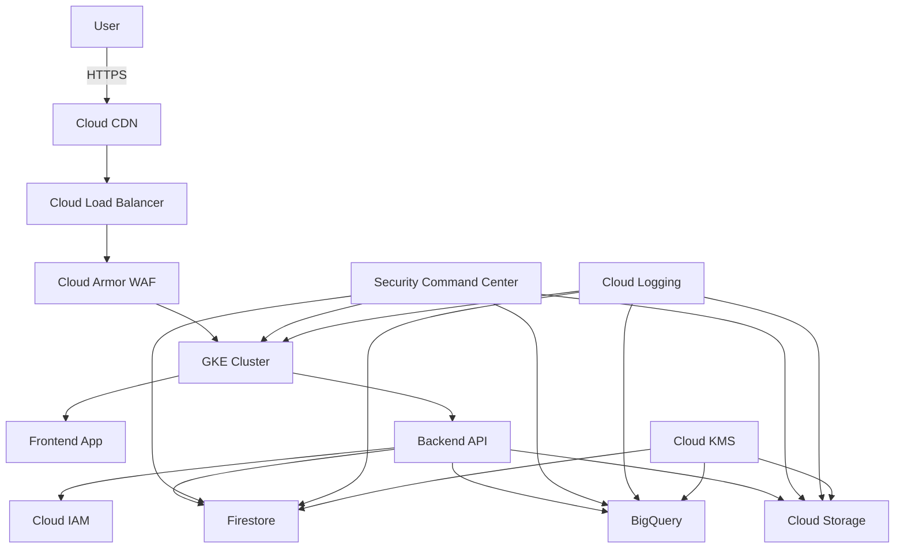

This security architecture ensures that the Code Skeptic Scanner implements multiple layers of security, from the network level to the application and data layers, leveraging Google Cloud's security features and industry best practices.